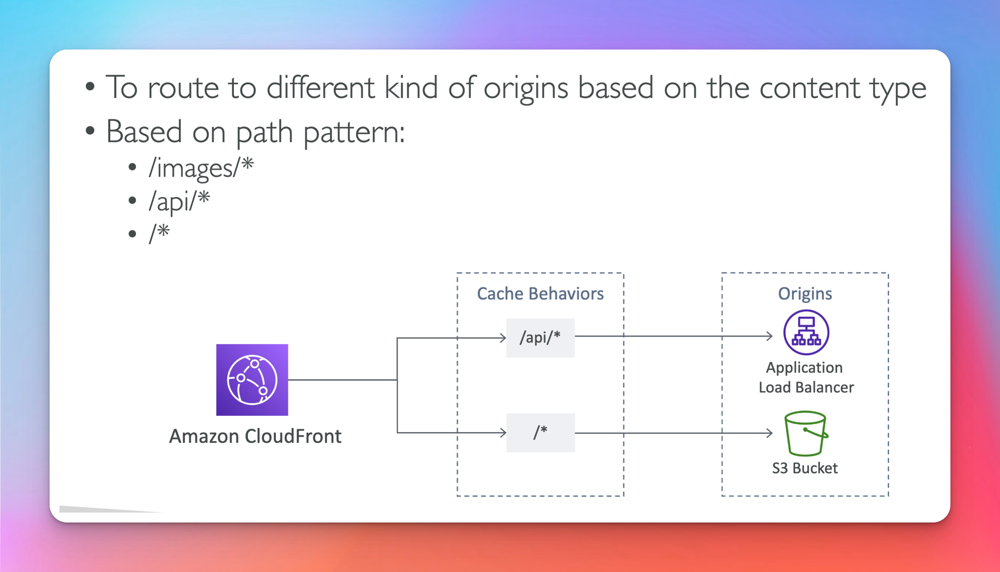
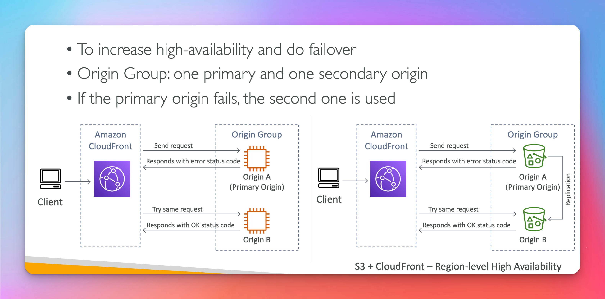

# CloudFront

[CloudFront](https://aws.amazon.com/cloudfront/features/?nc=sn&loc=2&whats-new-cloudfront.sort-by=item.additionalFields.postDateTime&whats-new-cloudfront.sort-order=desc)

## CloudFront Origins

## CloudFront HighLevel

## S3 as a Origin

## ALB as a Origin ( Exam )

## Geo Restrictions ( Exam Questions )

## Cloudfront vs S3 CRR

## Caching

## Maximize Hits by dynamic distribution

## CloudFront Security

## HTTPS

## Signed Urls / Cookies

- url -> one to one ( url per file)
- cookie -> one to many ( one cookie many files)

## Signed Urls Diagram

## S3 Presigned Url vs Cloudfront Signed Url

## Signed Urls Process

## Advanced Concepts

### Pricing

- more data out the lower the costs
  
  
  

  ## Multiple Origin

  

  ## Origin Groups

  

  ## Field Level Encrpytion

  
  
  
  
  
  
  
  
  
  
  
  
  
  
  
  
  
  
