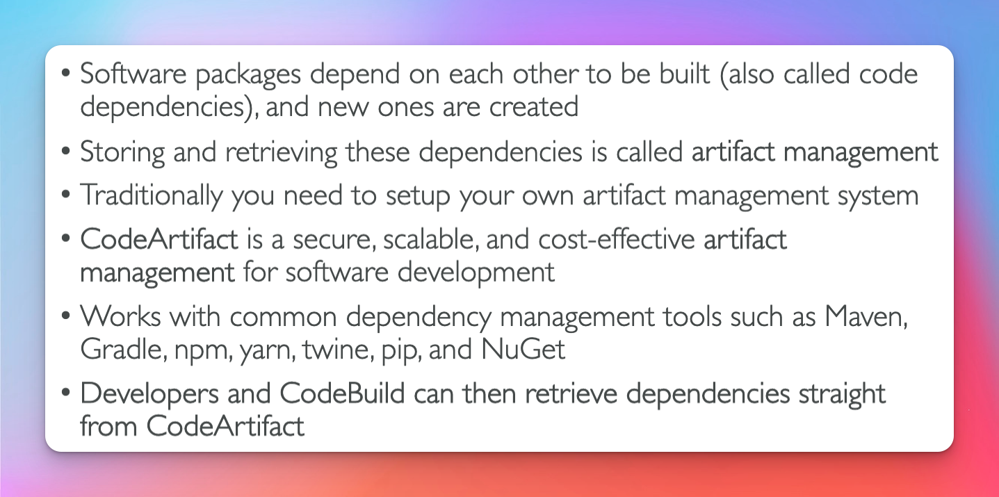
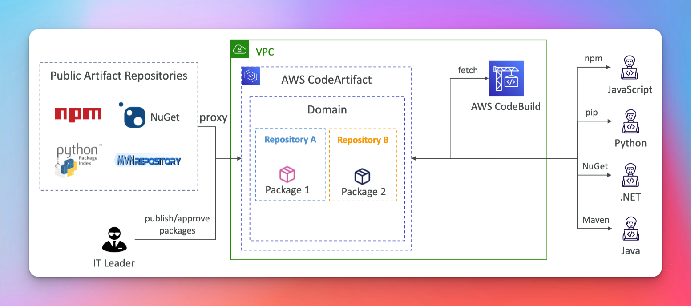

# CodeArtifact
- Artifact management system

## Flow

- Key Features
 1. proxy requests to public artifact repos
 2. publish your own artifacts 

**Note** when artifacts are created they are cache so if a public artifact repo is removed you still have a path to build your application