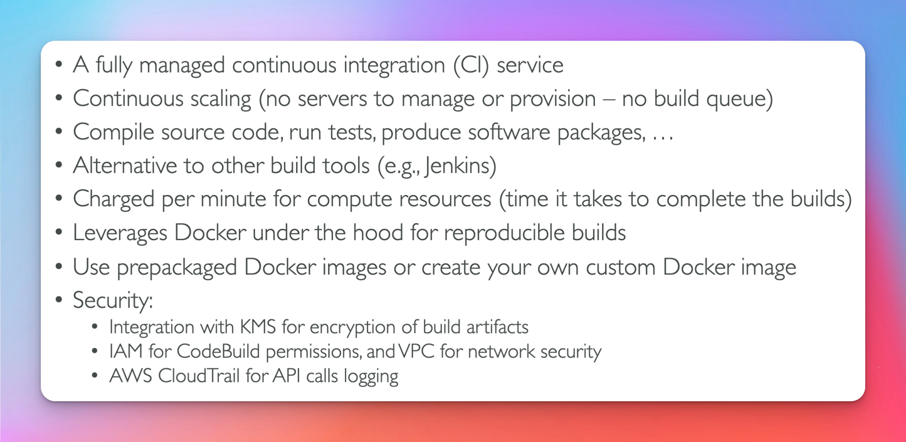
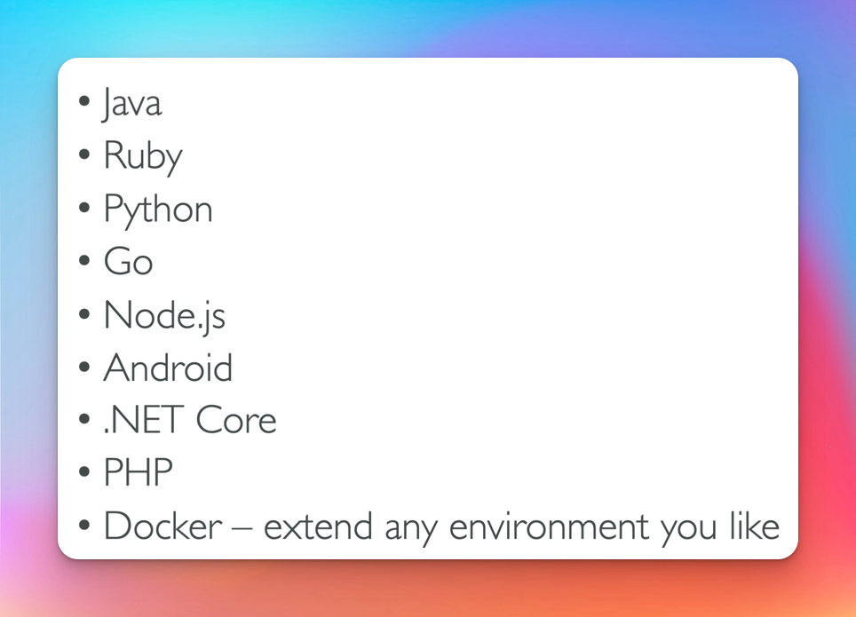
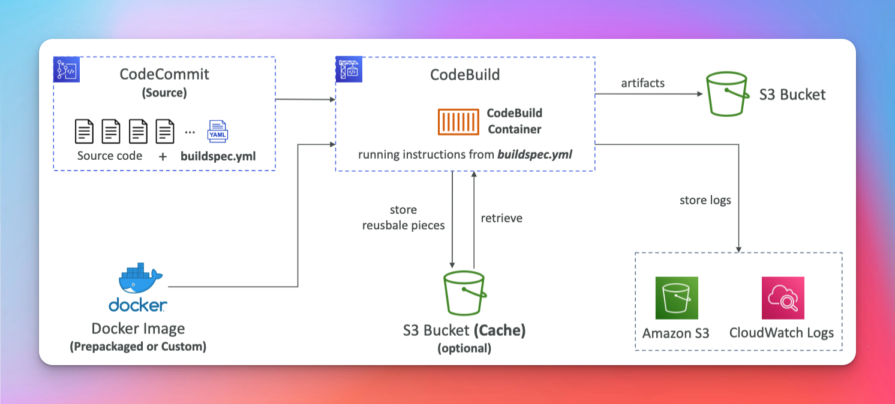
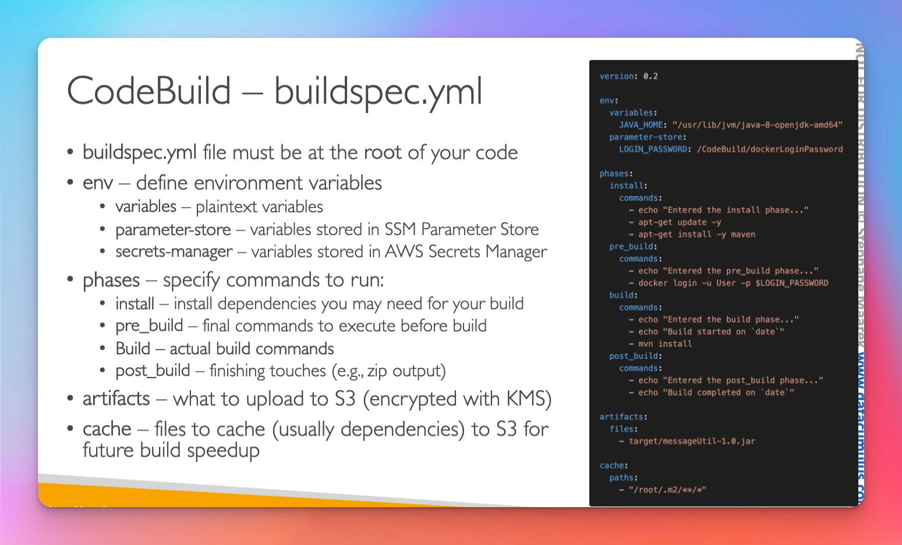
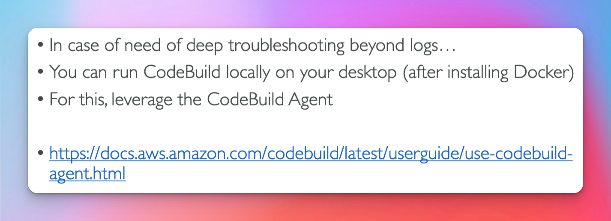
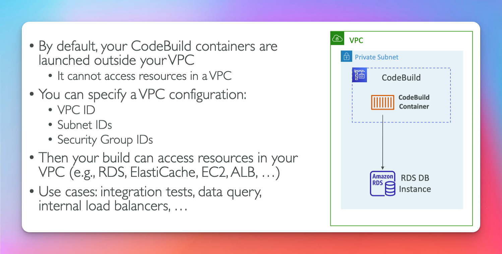
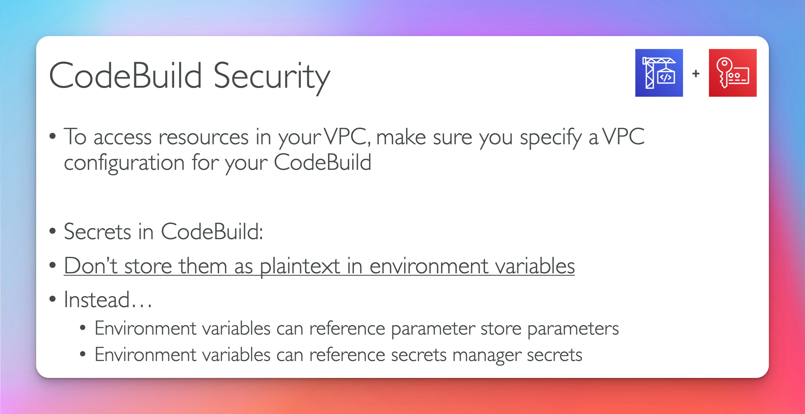

# CodeBuild

## Support Envs

## How it works

## buildspec.yml (very important)

- need to live in the root of your project
  

## Local Build

## CodeBuild Vpc

**Common use cases**

- integration testing
- data query

## CodeBuild Security

- be sure your iam role has permissions to access the SSM or Secrets Manager
  
