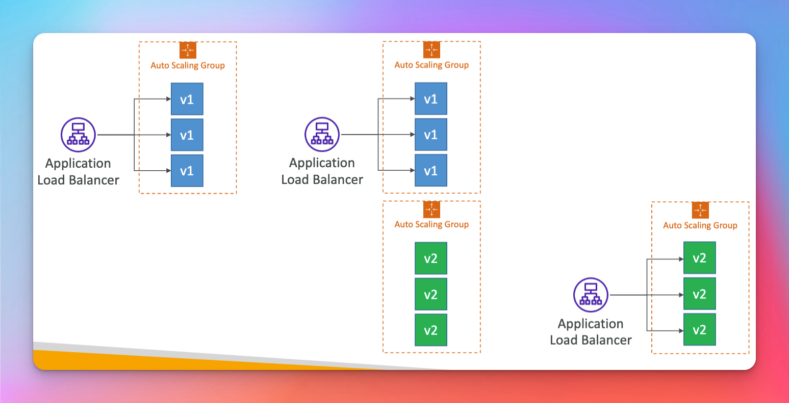

# CodeDeploy

## Make It Work
- Must need the Code Deploy Agent

## Components (Important !)

## Appspec.yml
- must be at the root of project
- ValidateService is very important it is the command executed to verify that the service is properly deployed

## Hooks Order (Note the Order!)

## Deployment Configuration

## In Place Deployment

## Blue Green Deployment

- Note for on-premise instances you must install the code deploy agent on them so that they can interact with this service

## Deployment on EC2

## Deployment to ASG

## Rollback && Redeploy
- technically it is a new deploy that releases last good version (not a restored version)

