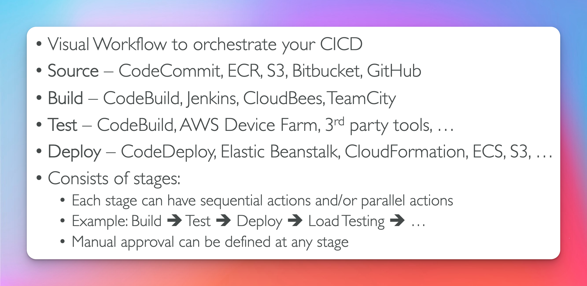
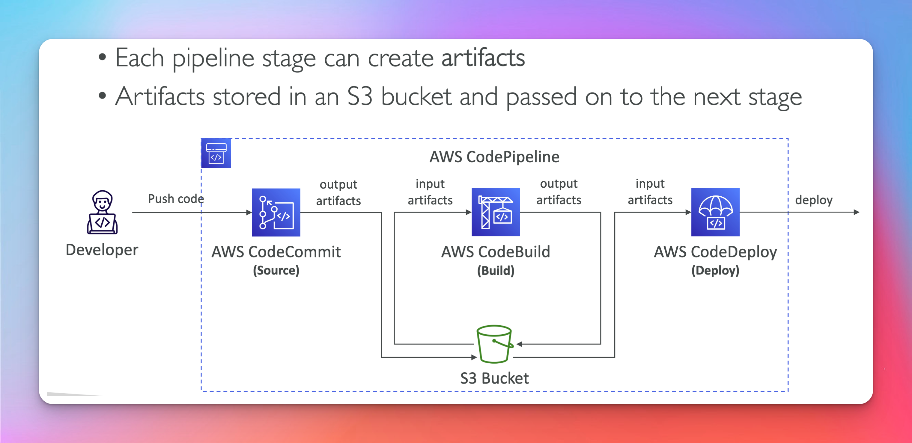
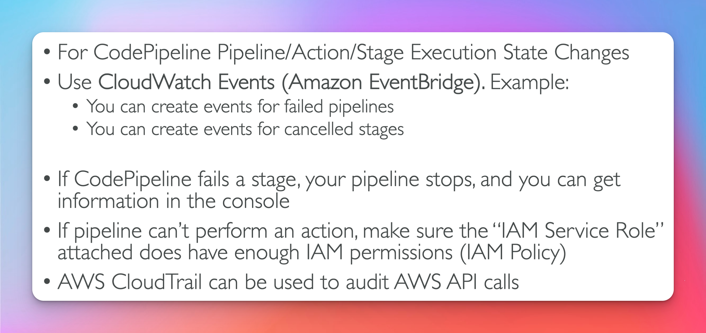
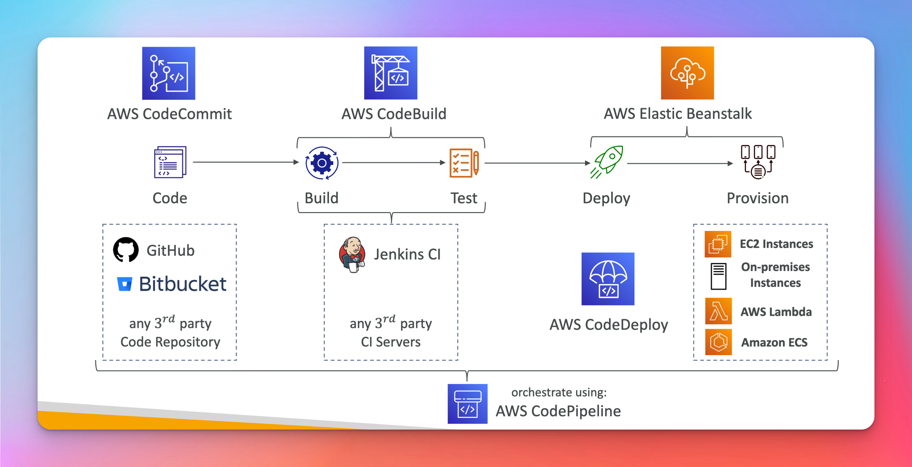

# CodePipeline

## Artifacts
- Think of this as an Orchestration Tool

## Trouble Shooting

## CICD STACK

- Action Groups live within stages 
- Stages can have multiple action groups
- Action groups can run parallel as well as sequentially