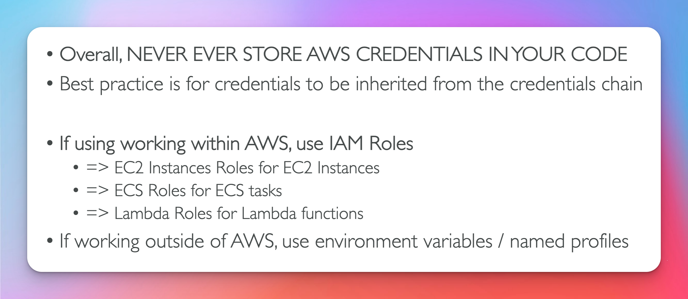
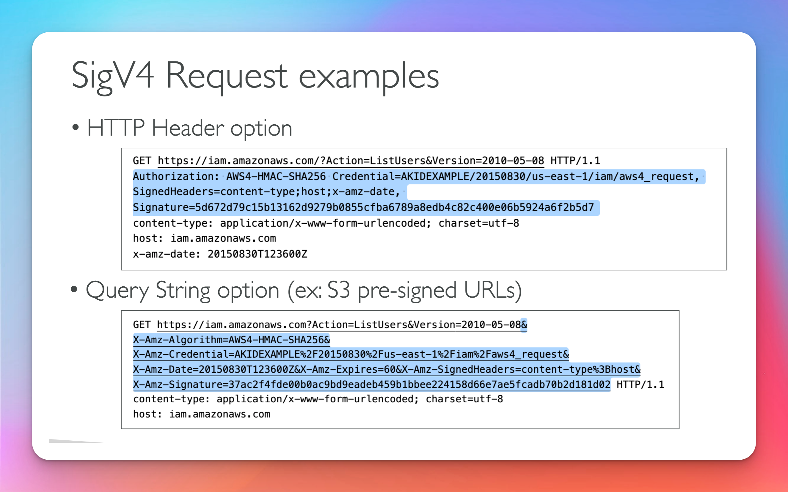

## AWS CLI Setup

1. create a fold named aws and navigate within it
   - <pre>mkdir aws && cd aws </pre>
2. Install aws cli

   - <pre> $ curl "https://awscli.amazonaws.com/AWSCLIV2..." -o "AWSCLIV2.pkg" </pre>

3. Install the aws package within the root directory

   - <pre> sudo installer -pkg AWSCLIV2 -target /</pre>

4. Check the the location of where aws was installed

   - <pre>which aws : output -> /usr/local/bin/aws </pre>

5. Retrieve aws Access Key ID and Secret Access Key ID \* <pre>Navigate to aws console click on your username and select My security credentials. Look for access keys for CLI,SDK & API Access, Click on create access key , then copy your Access Key ID & Secret Access Key to a txt file of your choosing. If this method doesn't work reach out to your supervisor to receive the necessary credentials.
</pre>

6. Configure aws credentials

   - <pre> execute cmd aws configure
           Enter Access key ID     : [Access key ID]
           Enter Secret Access Key : [Secret Access Key]
           Enter default region    : us-east-1
           Enter output format     : json
     </pre>

7. Verify that you are connected to aws
   - <pre> aws sts get-caller-identity :
       Desired output: 
       {
           "UserId": "Amazon User ID"
           "Account": "Amazon Account ID"
           "Arn": "Amazon Resource Name"
       }
     </pre>

## AWS CLI CMDs

<pre>
 aws --version -> Verify the version AWS CLI
</pre>

## Manually Provision CICD delivery project

    This is a how we interact with the formation build project.
    TF_DIR -> the desired directory
    TF_COMMAND -> the terraform command you want to execute (you can also pass in the destroy cmd to have formation-build remove desired infrastructure)

 <pre>
 aws codebuild start-build \
     --profile [profile name] \ 
     --project-name [project name] \ 
     --source-version [branch name] \ 
     --source-location-override [bitbucket url aka repo location] \
     name=TF_DIR,value=tf/cicd/[stage || prod],type=PLAINTEXT
     name=TF_COMMAND,value=apply,type=PLAINTEXT
 </pre>

# [Aws Developer Resources](https://docs.aws.amazon.com/index.html?nc2=h_ql_doc_do "AWS Docs")

    I will be explaining the basics about common aws developer resources and the necessary iac needed to define them.

## [Lambda](https://docs.aws.amazon.com/lambda/latest/dg/welcome.html "Lambda Docs")

    Lambda is a compute service that lets you run code without provisioning or managing servers. See Terraform iac below for more.

    Lambda allows you to trigger execution of code in response to events in AWS, enabling serverless backend solutions.

    Check lambda.tf file within the example service folder for a in depth look at the iac.

## [Api Gateway](https://docs.aws.amazon.com/apigateway/latest/developerguide/welcome.html "Api Gateway Docs")

     Amazon API Gateway is an AWS service for creating, publishing, maintaining, monitoring, and securing REST, HTTP, and WebSocket APIs at any scale. API developers can create APIs that access AWS or other web services, as well as data stored in the AWS Cloud.

## [Dynamo DB](https://docs.aws.amazon.com/amazondynamodb/latest/developerguide/Introduction.html "Dynamo DB Docs")

     Amazon DynamoDB is a fully managed NoSQL database service that provides fast and predictable performance with seamless scalability.

    DynamoDB lets you offload the administrative burdens of operating and scaling a distributed database so that you don't have to worry about hardware provisioning, setup and configuration, replication, software patching, or cluster scaling.

## [Codebuild](https://docs.aws.amazon.com/codebuild/latest/userguide/welcome.html "Codebuild Docs")

    AWS CodeBuild is a fully managed build service in the cloud. CodeBuild compiles your source code, runs unit tests, and produces artifacts that are ready to deploy. CodeBuild eliminates the need to provision, manage, and scale your own build servers.

    1. As input, you must provide CodeBuild with a build project, A build project includes information about how to run a build, which build you use, which cmd to run and where to store desired output. A build environment represents a combination of operating system, programming language runtime, and tools that CodeBuild uses to run a build.

    2. CodeBuild uses the build project to create the build environment.

    3. Downloads the source code into the build environment and the uses the buildspec (build specification) this is defined in the source code. build specifications are a group of build cmd's and other related settings, IN YAML FORMAT.

    4. If there is any build output, the build environment uploads its output to an S3 bucket.

    5. While the build is running, the build environment sends information to CodeBuild and Amazon CloudWatch Log

    6. While the build is running, you can use the AWS CodeBuild console, AWS CLI, or AWS SDKs to get summarized build information from CodeBuild and detailed build information from Amazon CloudWatch Logs. You can get limit build info from AWS Code Pipeline

## AWS Configure Multiple Profiles

    CMD : export AWS_PROFILE=profile_name

    This cmd allows you to set the desired aws profile via aws cli.

1.  Navigate to the hidden .aws folder. Its location should be /Users/userprofile/.aws

2.  Once inside the folder there should be two files
    config && credentials

        You will need to reach out your supervisor to receive your 2nd account credentials.

        Once you received your account credential
        Access Key ID & Secret Access Key ID proceed to next step.

3.  Open the config && credential files within a text editor of your choosing.

    In the credential file add your new aws Access Key ID and Secret Access Key to the file. Also, be sure to give each pair of credentials a profile name. See example below

    ```
        [profile1]
        aws_access_key_id = Access Key ID
        aws_secret_access_key = Secret Access Key

        [profile2]
        aws_access_key_id = Access Key ID
        aws_secret_access_key = Secret Access Key

    ```

    Once finished entering your Keys within credentials file save your changes and close the credential file.

4.  Navigate to the config file and open it with text editor.
    Next add the new profile and set the region and output format, you can also add a default (region/output) but this is optional.

    See example below.

    ```
        [profile profile1]
        region = us-east-1
        output = json

        [profile profile2]
        region = us-east-2
        output = json

        [default]
        region = us-west-1
        output = json

    ```

    Once changes are added save and close config file. Now you can use multiple aws profiles via terminal.

## AWS Policy Generator

[AWS Policy Generator](https://awspolicygen.s3.amazonaws.com/policygen.html "Policy Generator")

    This link allow you create custom aws policies for SQS,S3,IAM,VPC,and SNS.

## Adding Roles to EC2 Post Deploy with CLI

[Adding Roles to EC2 Post Deploy with CLI](https://aws.amazon.com/blogs/security/new-attach-an-aws-iam-role-to-an-existing-amazon-ec2-instance-by-using-the-aws-cli/)

[EC2 CLI CMDS](https://docs.aws.amazon.com/cli/latest/reference/ec2/describe-instances.html)

### Cli Cmd for Finding Running Ec2 in specific Region

<pre>aws ec2 describe-instances --region us-east-1 --filters Name=instance-state-name,Values=running</pre>

## CLI --dry-run


## STS


#### Example:

`aws sts decode-authorization-message --encoded-message <value>`

[Cli Reference]('https://docs.aws.amazon.com/cli/latest/reference/sts/index.html')

## EC2 Instance Metadata


**internal url** -> http://169.254.169.254/latest/meta-data/

side note: when making internal request if the response ends with a slash there is more to it. If it does not then its a value.

## MFA with CLI (Exam Question)


##### Example

[Cli Reference]('https://docs.aws.amazon.com/cli/latest/reference/sts/index.html')
`aws sts get-session-token --serial-number <resource arn> --token code <mfa code>`

## MFA Delete


## SDK Overview


**Pro Tips** (Exam Question)


If you do not specify a region the default that will be set is us-east-1 (Exam Question)

## AWS Limits


## Exponential Backoff (Exam Question)


Exponential Backoff explained - Double the time between each api call after error.

**Retry** api calls on 500 errors i.e (500, 503, etc..)
**DO NOT Retry** api calls on 400 errors i.e (400, 401, 403 etc..)

- **1st** call per sec if failed then
- **2nd** call after 2 secs if failed then
- **3rd** call after 4 secs if failed then
- **4th** call after 8 secs if failed then
- **5th** call after 16 secs if failed then ....

## CLI Credentials Provider Chain (Exam Question)


**First Priority**

<pre> Aws Access Key

 Aws Secret Access Key

 Session Token

 CLI Options: --region --output --profile
</pre>

**Second Priority**

<pre>
    ENV Variables
</pre>

**Third Priority**

<pre>
    Credentials File
</pre>

**Fourth Priority**

<pre>
    Cli Config File
</pre>

**Fifth Priority**

<pre>
     Container Creds For ECS
</pre>

**Sixth Priority**

<pre>
      EC2 Instance Profile 
</pre>

### AWS Credentials Scenario

An application deployed on an EC2 instance is using a ENV Var with credentials from an IAM user to call the Amazon s3 API.

The IAM user has S3 FullAccess permissions

The application only uses one S3 bucket, so according to best practice

- An IAM Role & EC2 Instance Profile was created for the EC2 instance
- The Role was assigned the minium permissions to access that one S3 Bucket

However the IAM Instance Profile was assigned to the EC2 instance, but it still has Access to all S3 buckets. Why ?

## Best Practices



## Signing AWS API Requests

    1. Any api calls request to aws need to be signed with aws credentials

    2. This process of signing credentials is called SigV4




#### Two Options (Exam Questions )

    1. HTTP Header
    2. Query String
