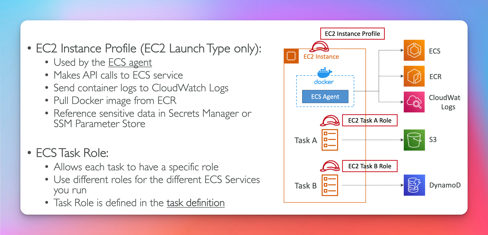
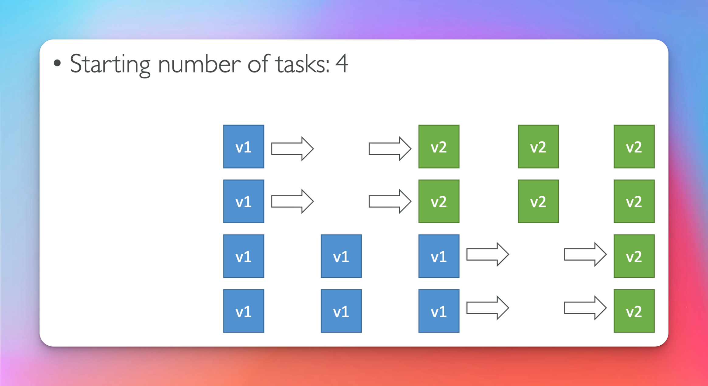

# ECS Elastic Container Service

## EC2 Launch Type

## Fargate Launch Type (Exam Pushes Fargate)

## IAM Roles for ECS

- Know the distinction between Instance Profile Role and Task Role
- Valid for both Ec2 and Fargate Launch Types (Task Roles)

## Load Balancer Integrations

## Data Volumes (EFS)

- Use case: persistent multi-az shared storage for containers
- note s3 can't be mounted as a file system

## ECS Auto Scaling

## EC2 Auto Scaling

- if you have to choose use **ECS Cluster Capacity Provider**

## Scaling Example

## ECS Rolling Updates

## Min 50 Max 100 (Exam Question)

## Min 100 Max 150 (Exam Question)

# Solution Architecture

## ECS invoked by Event Bridge

- example of a serverless architecture that processes object from s3 using docker container

  

## ECS invoked by Event Bridge Schedule

## ECS SQS Queues

# Task Definitions (Exam Questions)

## Load Balancing EC2 Launch Type

## Load Balancing Fargate Launch Type

## Iam Roles ECS (Exam Question)

- Where do you define a iam role for ecs tasks ?

## Env Variables

## Data Volumes (Bind Mounts)

## Data Volumes EFS

# Task Placement (Exam Question)

### Process

### Constraints

- **distinctInstance** task place on different instance.
- **memberOf** specify type of instance task should be ran on.
  

### Strategies (Exam Question)

- **Binpack** _cost saving_
  

- **Random** _random provisioning_
  

- **Spread** _high availability_
  

- **Mixing Strategies** _combine strategies_
  
