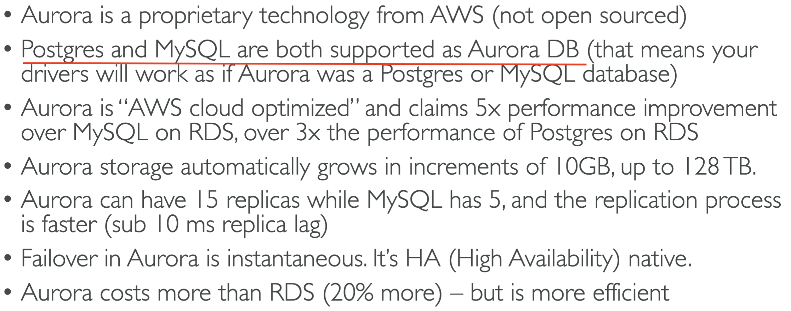
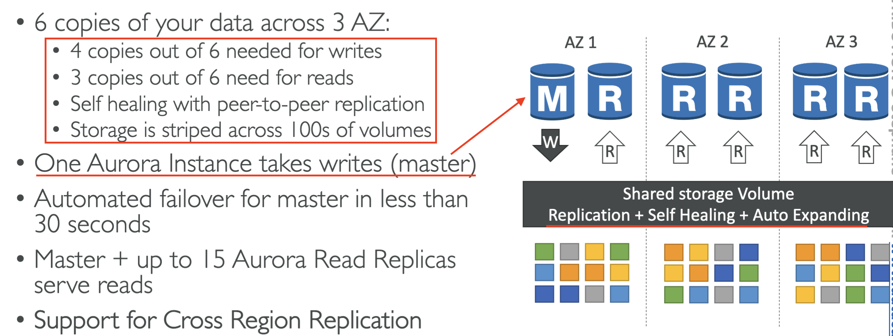
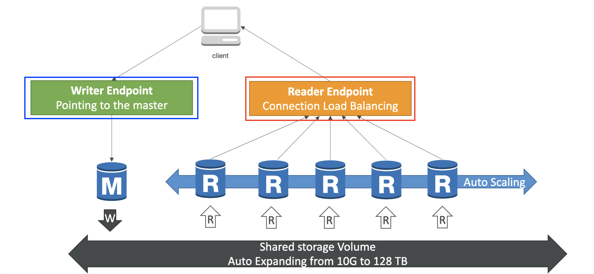
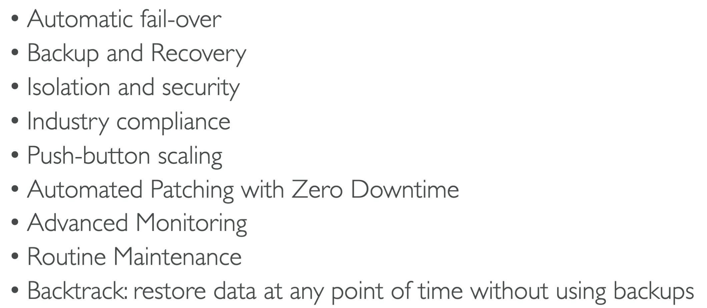
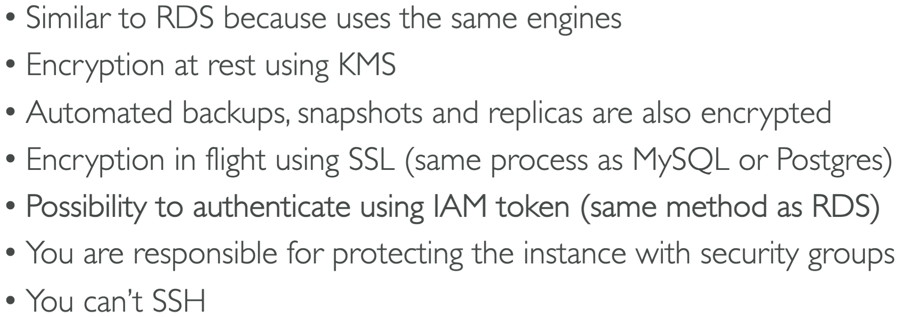

# Amazon Aurora

## High Availability & Read Scaling

## Aurora DB Cluster

<pre>Exam Questions: Reader Endpoint connects to automatically to all read replicas. This has the exact same feature as the writer endpoint but for read replicas.</pre>

**Note**: the load balancing happens at the connection level and **NOT** the statement level.

## Aurora Features

## Aurora Security

