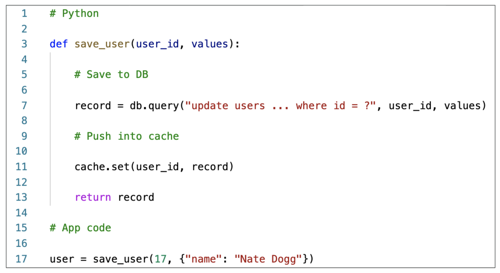

# Amazon ElastiCache

## Solution Architecture - DB Cache

## Solution Architecture - User Session Store

## Redis vs Memcached (exam question)

<pre> 
Redis - > High Availability, Back Up, Read Replica
Memcached - > Pure cache distribution
</pre>

## Cache Security

## Replication Cluster Mode Disabled (exam question)

## Replication Cluster Mode Enabled (exam question)

## Caching Implementation Considerations

[Read More](https://aws.amazon.com/caching/best-practices/ "AWS Caching")

### Lazy Loading - Cache-Aside - Lazy Population (exam ?)

#### Lazy Loading - Cache-Aside - Lazy Population

### Python Pseudos code

### Write Through - Add or Update cache when db is updated

## Write Through - Python Pseudos code

## Cache Evictions and Time to live (TTL)

## Words of Wisdom

Cached Evictions -> You have noticed that there are a large number of requests that go to the database because a large number of items are removed from the cache before they expire.

Cache Invalidations ->
