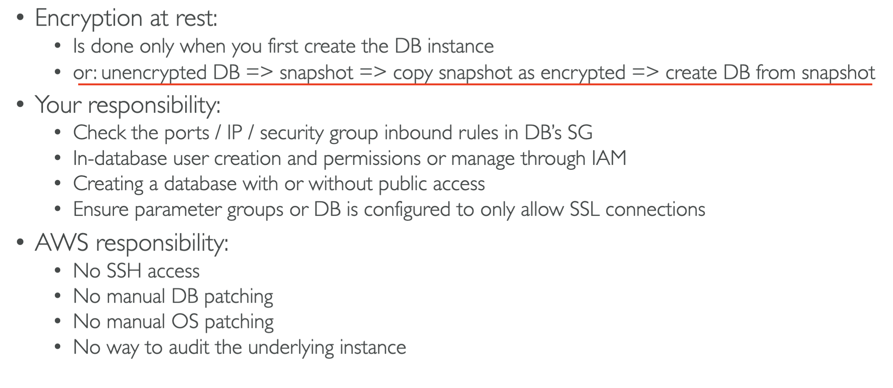

# RDS Relational Database Service

## RDS vs EC2

## RDS Backups

## RDS Storage Auto Scaling (exam question)

## RDS Read Replicas for read scalability (exam question)

3 Options for Read Replicas (up to 5)

1. Within a AZ
2. Cross AZ
3. Cross Region

## RDS Read Replicas Uses Cases

## RDS Read Replicas Network Cost

## RDS Disaster Recovery Multi AZ

<pre>Exam Question: Can you set up your read replicas as Multi AZ for DR ?</pre>

<pre>Answer: Yes </pre>

## From Single AZ to Multi AZ (exam question)

## RDS Security

## RDS Encryption (exam question)

<pre>Exam Question: Can you encrypt read replicas if the master is NOT encrypted.</pre>

<pre>Answer: No </pre>

<pre>Exam Question: Can you copy a snapshot of an un-encrypted database into an encrypted one ?</pre>

<pre>Answer: Yes </pre>

## Network & IAM Security

## IAM Authentication

## RDS Security Summary

<pre>
Multi Az
When using this feature you do not need to update the SQL connection string.

Multi Az Sync Replication 
Read Replica Async Replication

IAM Auth does not work with ORACLE.
</pre>
