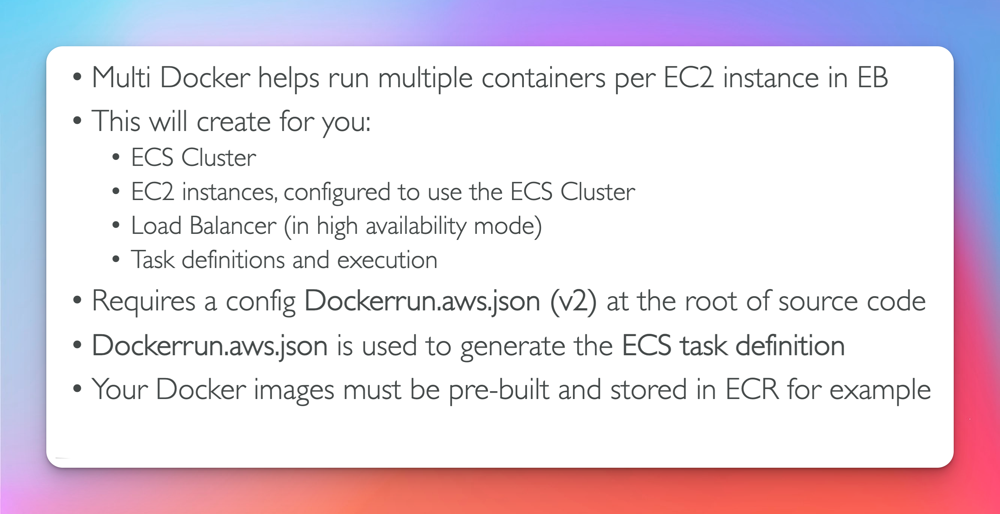

# Elastic Beanstalk

## Common Developer Issues

## Elastic Beanstalk Components 

## Supported Platforms

## Server vs Worker

#  Deployment Modes (Exam Questions)

## Updates for Deployment

## All at once 

## Rolling 

## Rolling with Batches

## Immutable

## Blue Green
- Note this is very manual (you are doing most of the work)

## Traffic Splitting
- used for canary testing 

## Deployment Methods Summary
[Official Docs Bean Stalk Deployment Methods](https://docs.aws.amazon.com/elasticbeanstalk/latest/dg/using-features.deploy-existing-version.html)

## CLI

## Deployment Process

## Lifecycle Policy

## Extensions

## Under the Hood

## Cloning 

## Migrations - (exam questions)

## RDS with EB Stalk

## RDS decoupling

## EB Stalk with Docker

## EB Stalk with Docker && ECS

## Advanced Concepts
### Https

### Web Server vs Worker Env

### Custom Platform (exam question)
- if you see packer think custom platform
