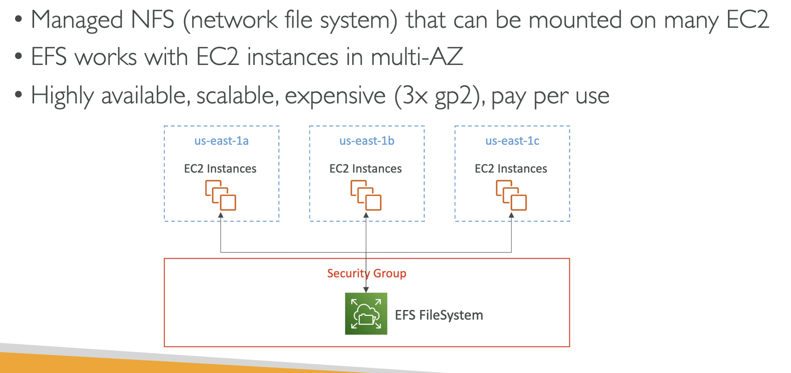
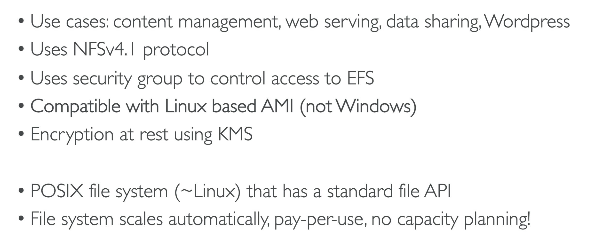
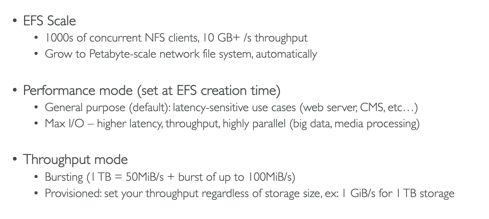
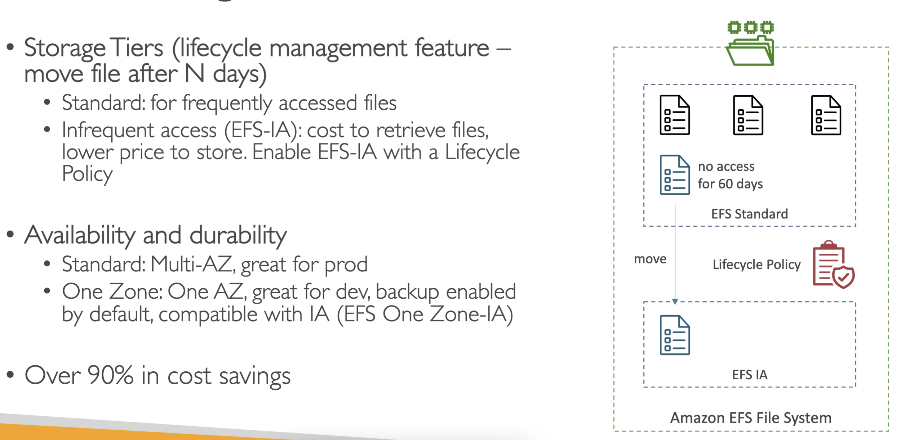
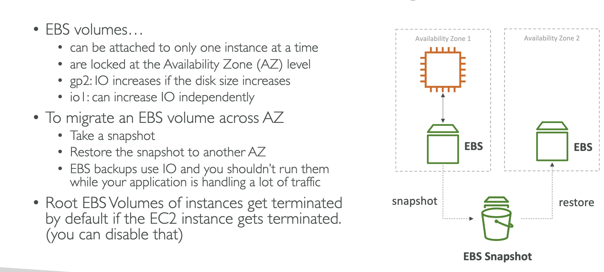
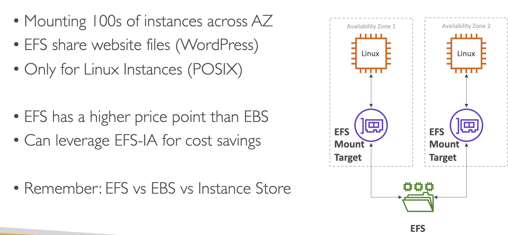

# EFS (Elastic File System)

<pre>
Regional = Standard
</pre>

## Use Cases

## Performance & Scale (exam question)

## Storage Classes (exam question)

### Possible Exam Questions

<pre>
When should you use EFS ?
</pre>
<pre>
What options should you set on your EFS network file system to insure that validate and comply with requirements ?
</pre>

 # EBS VS EFS
 
 

 

 > EFS you pay for what you use.

 > EFS network file system mount across multiple instances.