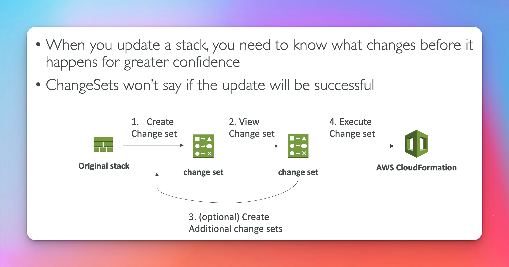

# Cloud Formation

## Infrastructure As Code

## Cloud Formation Benefits 1/2

## Cloud Formation Benefits 2/2

## How does it Work ?

## Deploy CloudFormation Templates

## CloudFormation Building Blocks

- Resources are REQUIRED
  

## YAML

## Resources

- Resource must have a type and have properties
  

[AWS Resource Type References](https://docs.aws.amazon.com/AWSCloudFormation/latest/UserGuide/aws-template-resource-type-ref.html)

[EC2 Resource Type](https://docs.aws.amazon.com/AWSCloudFormation/latest/UserGuide/aws-properties-ec2-instance.html)

## FAQ

## Parameters

## Parameters Use Cases

## Parameters Settings

## Parameters Reference

## Pseudo Parameters

## Mappings

## Mappings vs Parameters

## Fn::FindInMap (Exam question)

## Outputs (Exam question)

## Outputs Example

## Cross Stack Ref (Fn::ImportValue) (Exam question)

## Conditions

## Define Condition

## Using Conditions

## Intrinsic Function (Exam question)

- must know
  

## Fn::Ref

## Fn::FindInMap

## Fn::GetAtt

## Fn::Join

## Fn::Sub

## Rollbacks

## Change Sets

## Nested Stacks

## Cross vs Nested

## Stack Sets

- anything about update a cf stack in multiple accounts and in multiple regions think stack sets.

  

## CloudFormation Drift

