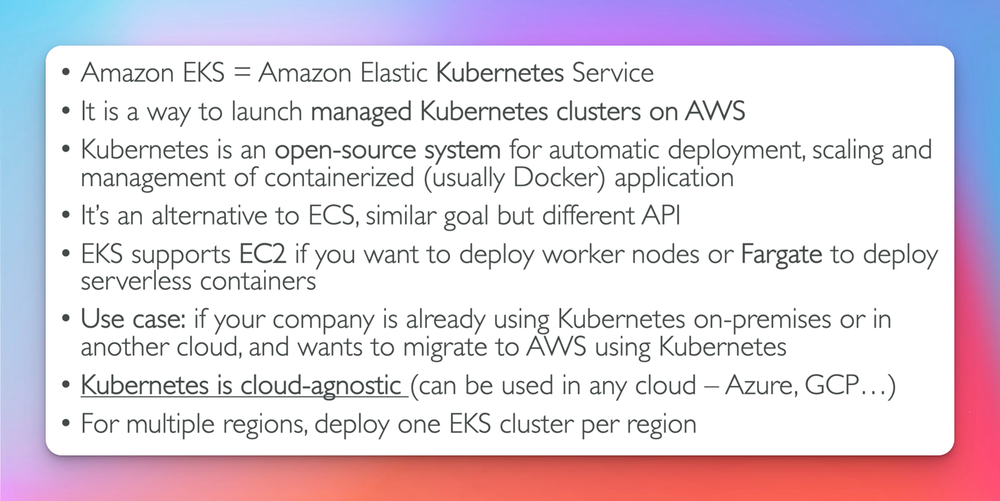

# Elastic Kubernetes Service

## Diagram

## Node Types

- Managed Node Groups

  - creates and manges nodes (EC2) for you
  - nodes are part of as asg mananged by EKS
  - supports On-Demand or Spot Instances

- Self Managed Nodes

  - nodes created by you & registerd to the EKS cluster and managed bt an ASG
  - supports On-Demand or Spot Instances

- AWS Fargate Nodes
  - No Maintenance required: no nodes managed

## Data Volumes

- Need to specify Storage Class mainfest on your EKS cluster
- Leverages a container storage interface compliant driver

support for the following

- EBS
- EFS (only one that works with fargate)
- FSX for Lustre
- FSX for NetApp ONTAP
