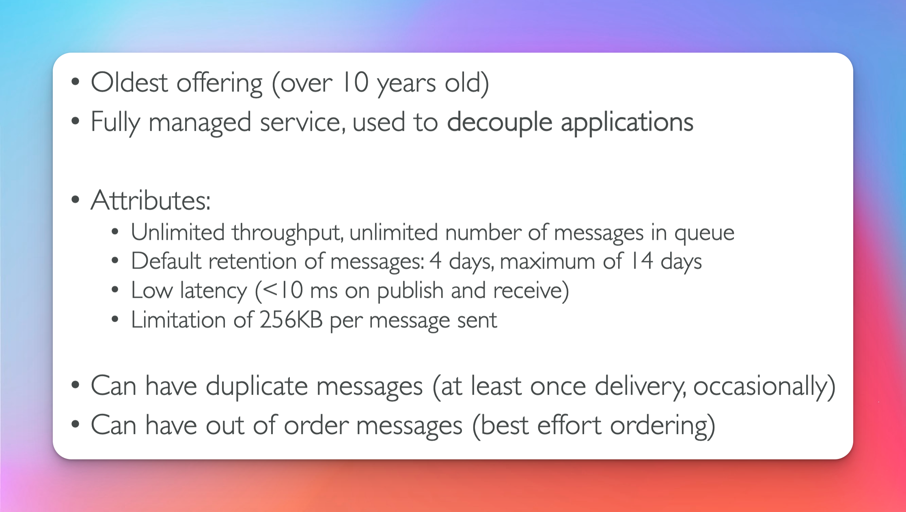

# Simple Queue Service

## What is a Queue ?

- Producer sends messages into a queue
- Costumer pulls messages from a queue

  

## Standard Queue

- When you see decouple applications think SQS

  

## Producers

- Uses SendMessage API
- unlimited throughput
  

## Consumers

- can receive 10 messages at a time (ReceiveMessage API)
- responsible for deleting messages Uses DeleteMessage API
- 

## Multiple EC2 Instance Consumers

- at least once delivery
  

## ASG (Exam Question)

- ApproximateNumberOfMessages (CloudWatch Metric - Queue Length)
  

## Decouple Application tiers ( Exam Question )

- very common architecture
  

## Security

## Access Policy (Exam Question)

- What is needed to publish an event to an sqs queue from s3 ?
- What is needed for sqs queue cross account access ?
  **Common Use Cases**
- cross account access
- publish s3 event notifications to sqs queue
  

## Message Visibility Timeout (Exam Question)

- while you receive a message it will become invisible to other consumers
  

## Message Visibility Timeout Continued (Exam Question)

- ChangeMessageVisibility API is called if consumer needs more time to process message

  

  ## Dead Letter Queues

  - **MaximumReceives** is a threshold that is set for messages, once exceed it send messages to a DLQ
  - useful for debugging

    

  ## Redrive to Source

  - Redrive is used to send messages back to source sqs queue.
    

    ## Delay Queue

    - DelaySeconds param
      

# Certified Developer SQS Concepts

## Long Polling (Exam Question)

- if **receive message wait time**is 0 the queue is (short polling)
- **consumer** should wait up to 1-20 secs to receive a message if the queue is empty (long polling)
- If a **consumer** is making **too many api calls** a way to solve that is with (long polling)
- (long polling) is used for **decreasing api calls and decreasing latency** (increasing efficiency)
- can be enable at the queue level or api level using **WaitTimeSeconds** param
  

  ## SQS Extended Client

  - uses pointers
  - common use case to process video files
    

## SQS API

## SQS FIFO Queue

- name must end with .fifo
- limited throughput
- used for the need to maintain ordering of messages
  

## FIFO Deduplication

## FIFO Message Grouping

## Ordering Data into SQS

