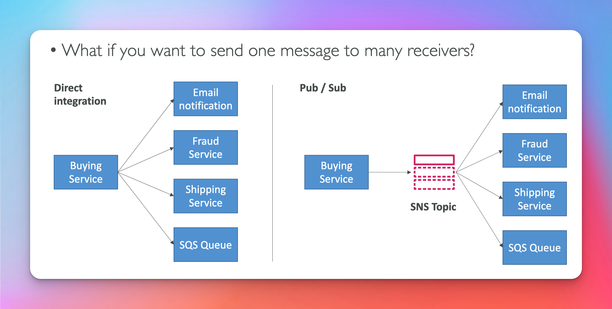

# Simple Notification Service

## Diagram

## SNS (Exam Question)

## Integrated Services

## How to publish

## Security (Exam Question)

## SNS + SQS Fan Out

## S3 Events to Multiple Queues

## SNS to S3 through Kinesis Data Firehose

## SNS FIFO Topic (Exam Question)

## FIFO Fan Out (Exam Question)

## Message Filtering (Exam Question)

## Protocols (Exam Question)

