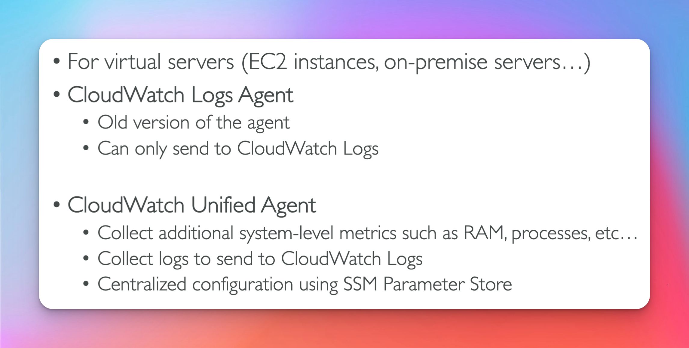
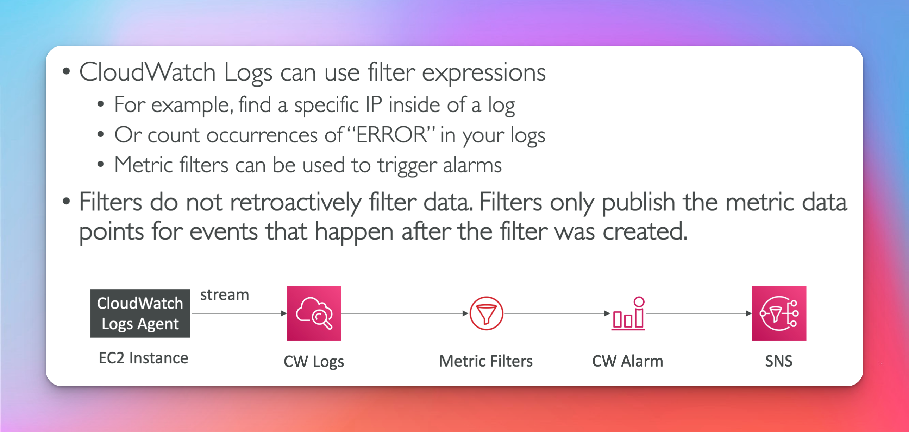

## Cloud Watch

## Metrics

## EC2

## Custom Metrics

- check cli docs put-metric-data [here]('https://docs.aws.amazon.com/cli/latest/reference/cloudwatch/put-metric-data.html')

- Note : A CloudWatch Alarm set on a High-Resolution Custom Metric can be triggered as often as 10 seconds
  

## CloudWatch Logs

- CloudWatch Logs, Log Retention Policy defined at Log group level.
  

## Sources

## Metric Filter and Insights

## s3 Export

## Subscriptions

## Log Aggregation

## Logs for EC2

## Logs Agent (Old) & Unified Agent (New)

- unified agent can do both (hence the name unified)
  

## Unified Agent Metrics (New)

- think more granular for this tool
  

  ## Metrics Filter

  - [filter & syntax patterns](https://docs.aws.amazon.com/AmazonCloudWatch/latest/logs/FilterAndPatternSyntax.html)

    

## Alarms

## Alarm Targets

## Composite Alarms

- CloudWatch Alarms monitor a single metric
- Composite Alarms Monitor the state of multiple alarms
  - you can use AND and OR conditions
  - helpful to reduce 'alarm noise' by creating complex composite alarms

## Instance Recovery

## Good to know

[set alarm state](https://docs.aws.amazon.com/cli/latest/reference/cloudwatch/set-alarm-state.html)

## Events

## Logs Encryption

