# X-Ray

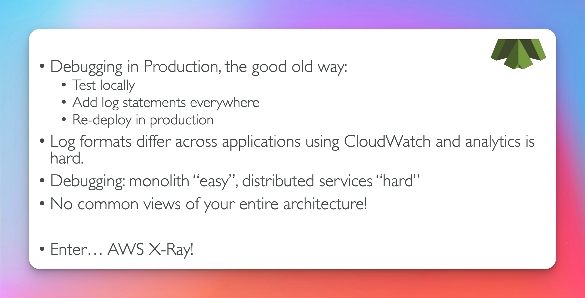

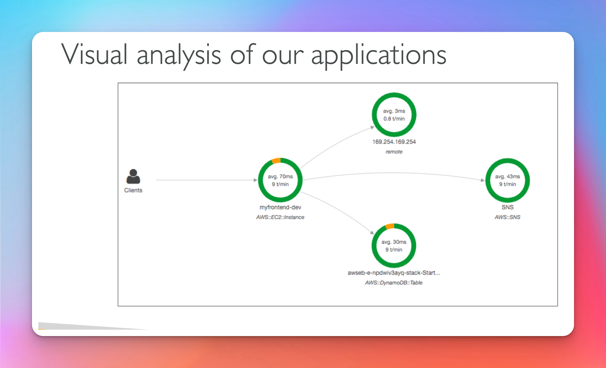

## Advantages

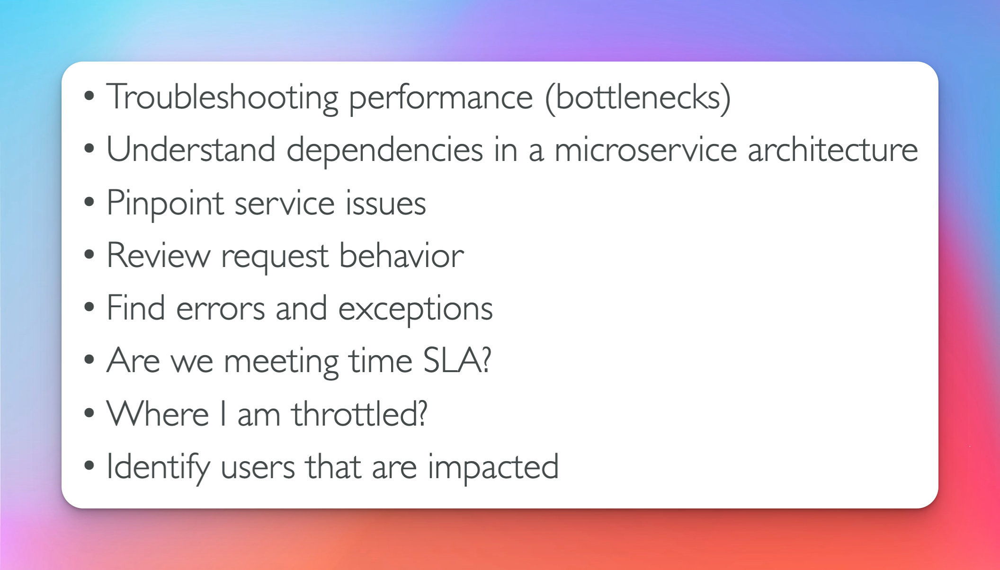

## Compatibility

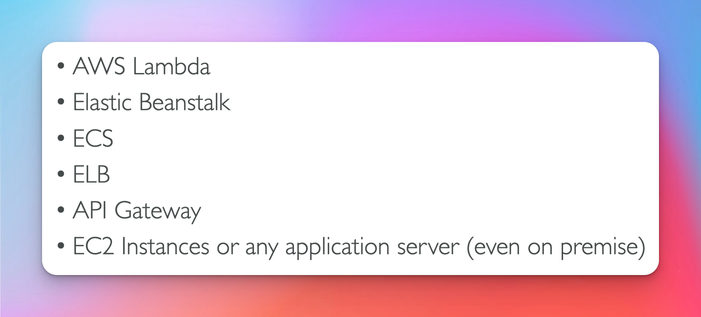

## Tracing

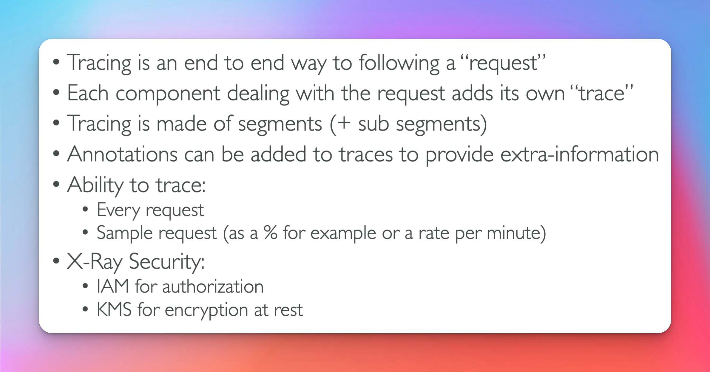

## Enable it ? (Exam Question)

- common question
  - x-ray application works locally but when deployed to EC2 it does not why ?

-> code + x-ray sdk -> x-ray daemon running on machine -> send batch every second

- for elastic benstalk how you enable x-ray is through the ebxentions file
  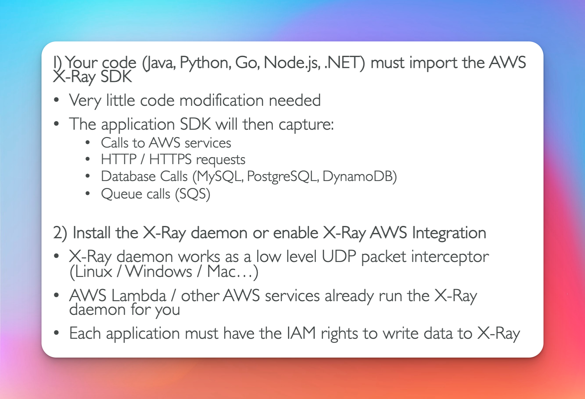

## Magic

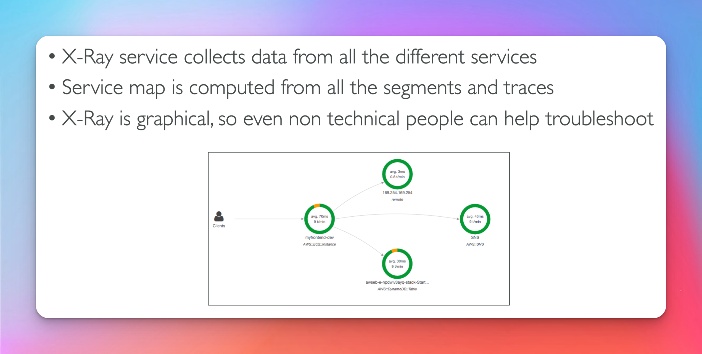

## Trouble shooting (Exam Question)

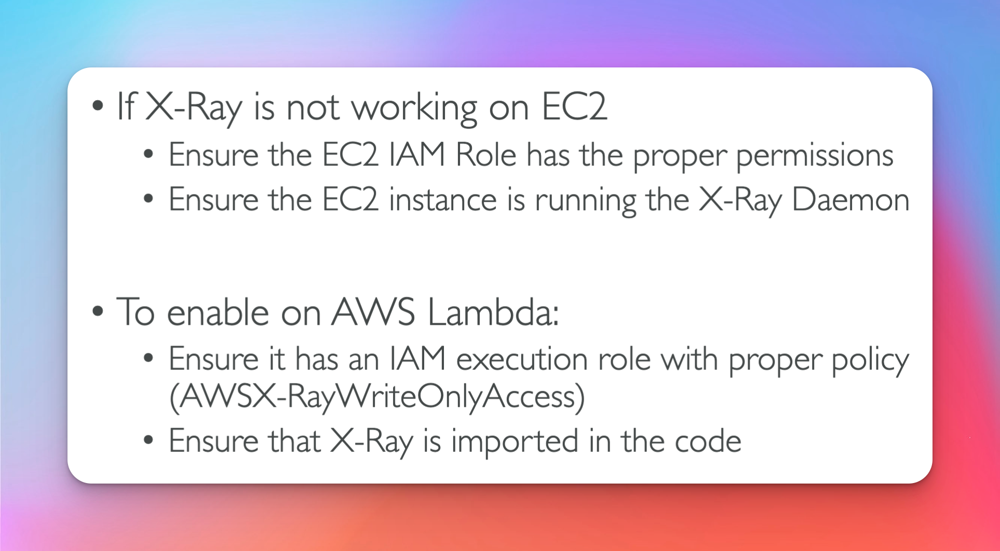

## X-Ray Instrumentation in code

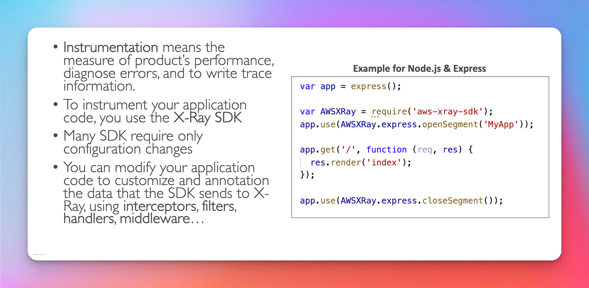

## Concepts

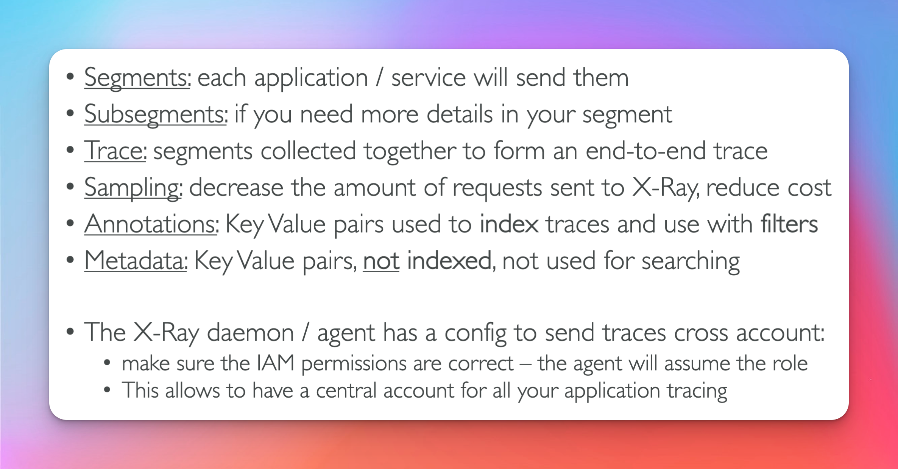

## Sampling Rules

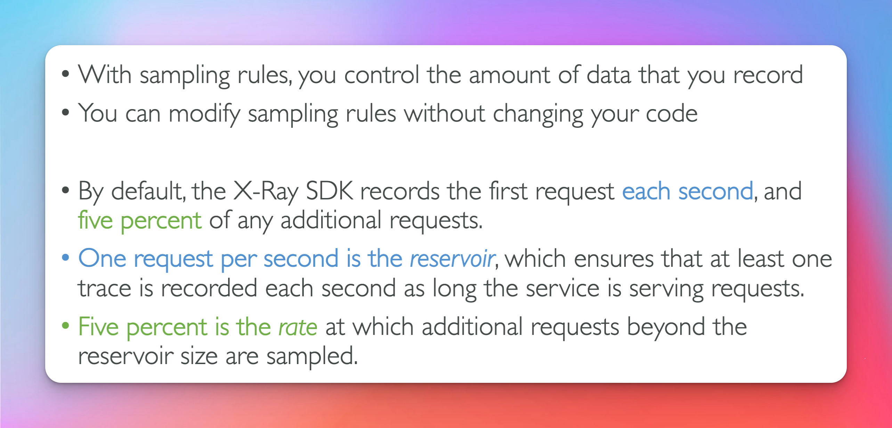

## Custom Sampling Rules

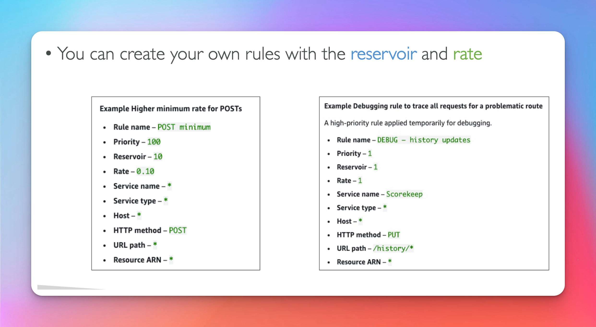

## Write Api

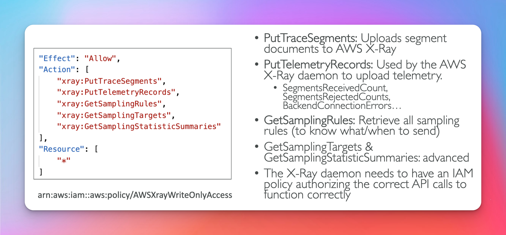

## Read Api

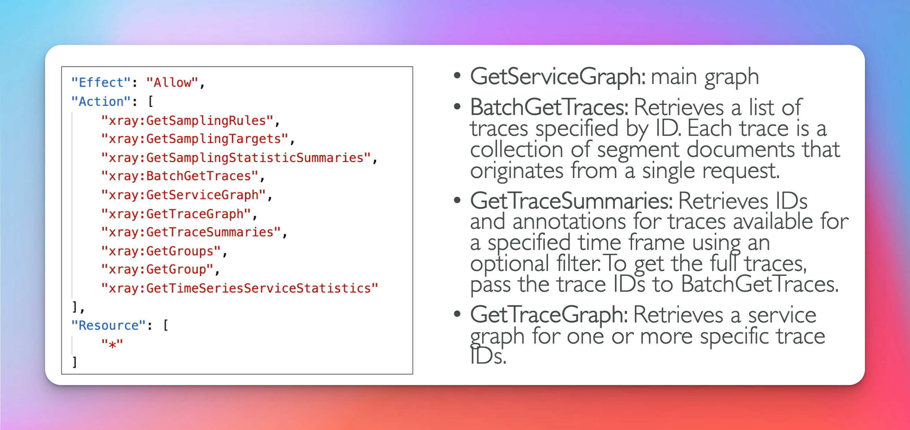

## XRay + BeanStalk

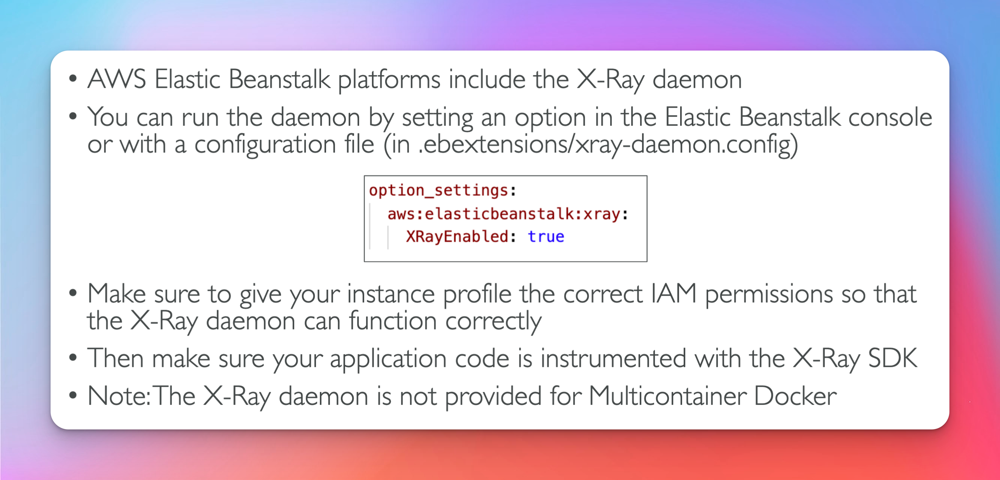

### Required Actions XRay + BeanStalk Within Xray Policy

- GetSamplingRules
- GetSamplingStatisticsSummaries
- GetSamplingTargets
- PutTelemetryRecords
- PutTraceSegments

## XRay + ECS integration options

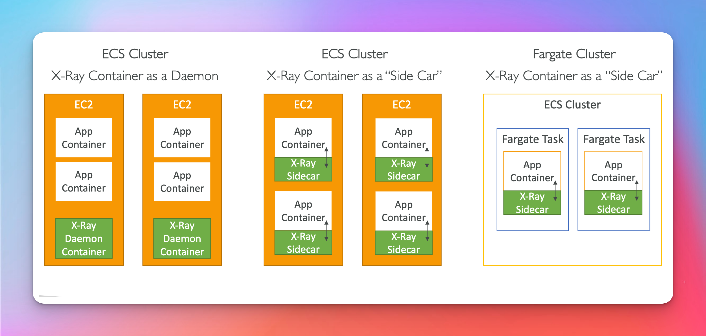

## XRay + ECS task definition (side car pattern)

- you need to map the container port of the x-ray daemon 2000 udp
- set env var called AWS_XRAY_DAEMON_ADDRESS
- link containers on network
- 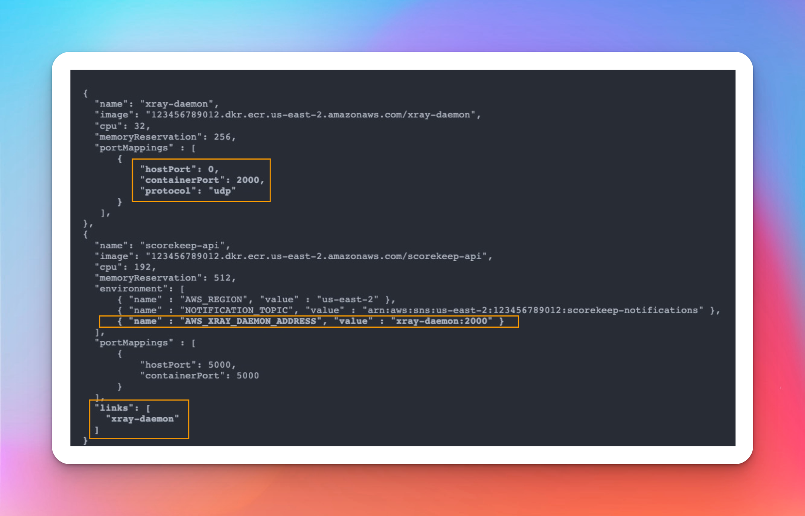
  
  
  
