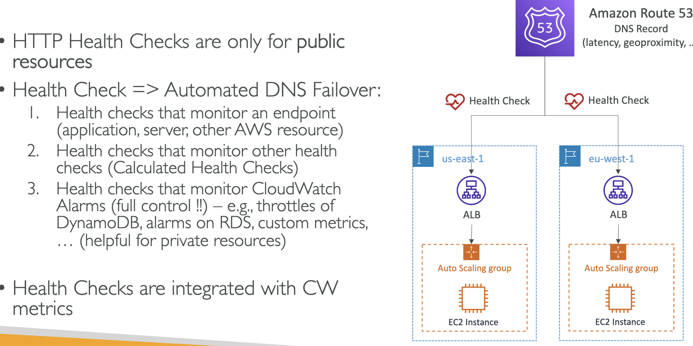
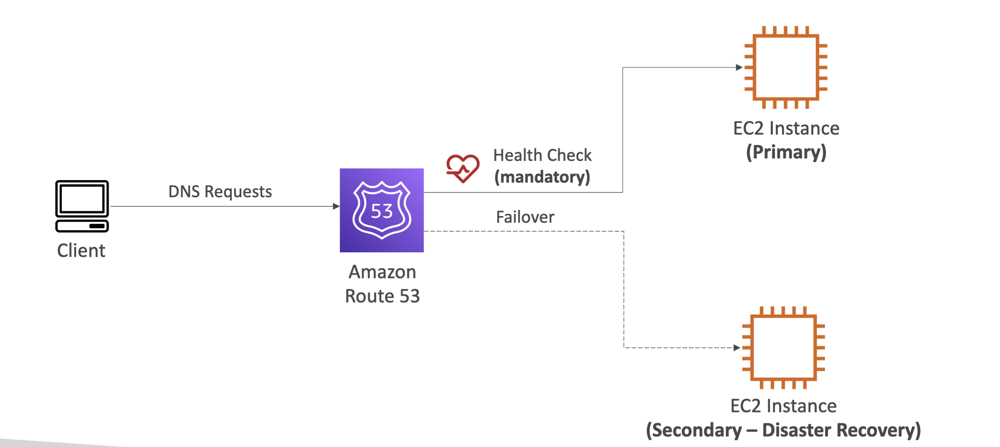

# Route 53

## Records

#

## Record Type

#

## Hosted Zones

#

## Public vs Private Hosted Zones

#

## Records TTL Time to Live

#

## CNAME vs Alias

#

## Alias Records

#

## Alias Records Targets

#

- exam questions
- you can create alias records at the apex domain.

## Routing Policies

#

#

#### Simple Routing Policies

#

#### Weighted Routing Polices

#

#### Latency Based Routing Polices

## Health Checks

#

### Monitor an Endpoint

#

### Calculated Health Checks

<pre >a health check that checks a health check is a Calculated Health Check</pre>

### Private Hosted Zones Health Checks

#

## Routing Policies Failover

#

## Routing Policies Geolocation (exam question)

#

## Routing Policies Geoproximity (exam question)

#

#

#

## Traffic Flow

#

## Routing Policies Multi Value

#

## Domain Registrar vs DNS Service

#

## GoDaddy as Registrar Route 53 as Service

#

## 3rd Party Registrar with Route 53

#

## IP's

34.230.81.203 -> us-east-1c
18.198.55.213 -> eu-central-1b
35.182.59.153 -> ca-central-1b

## ALB

route-53-demo-alb-2018819861.us-east-1.elb.amazonaws.com
