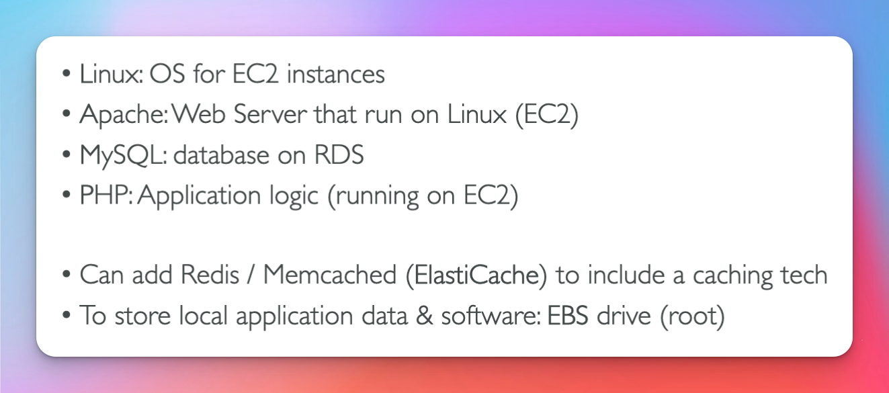

# VPC Crash Course

## VPC & Subnets

## ACL vs SG

## VPC FLow Logs

## VPC Peering

- Note that what non transitive means is that if you create a peering connection that for A -> B and another from B -> C you cannot talk to vpc C from A without setting up a peering connection for A and C first.

## VPC Endpoints

## Site to Site VPN

## Closing Comments

## 3 Tier Solution Architecture

- Route 53
- Public Subnet
- Private Subnet
- Data Subnet

## LAMP STACK

- Linux
- Apache
- MySql
- PHP
  

## WordPress On AWS

### High Level Architecture

### Low Level Architecture

