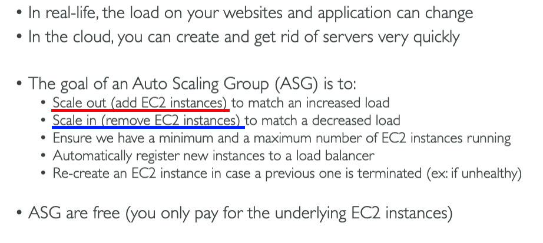
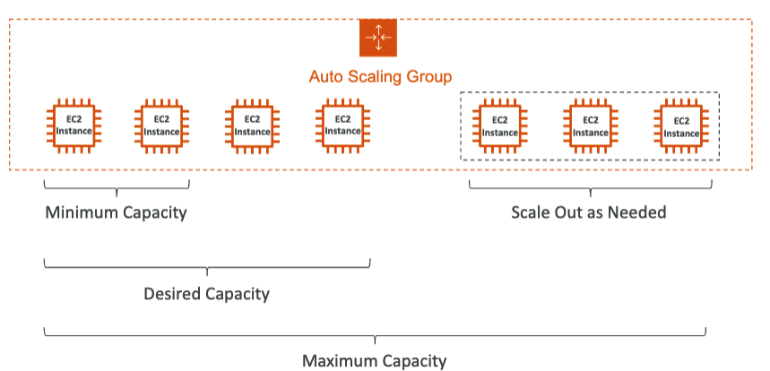
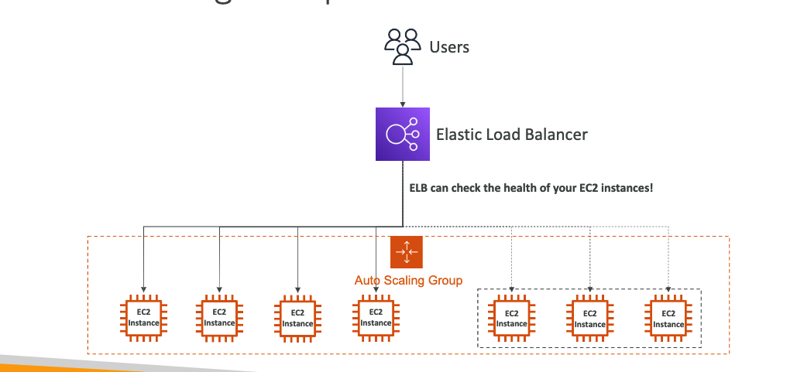
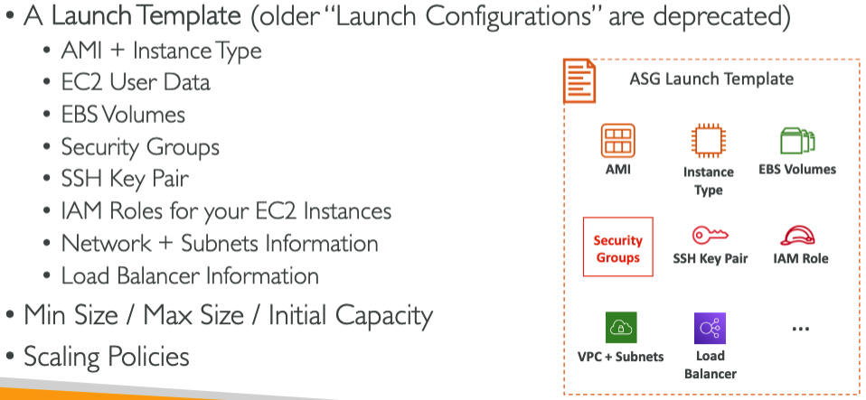
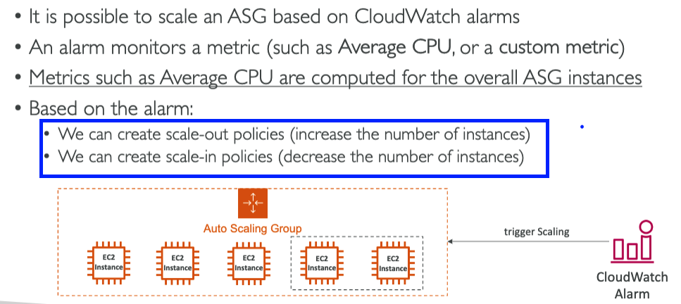
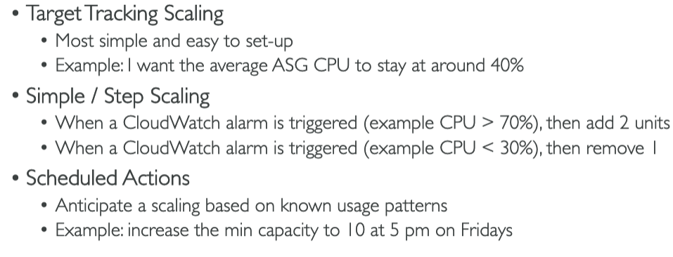
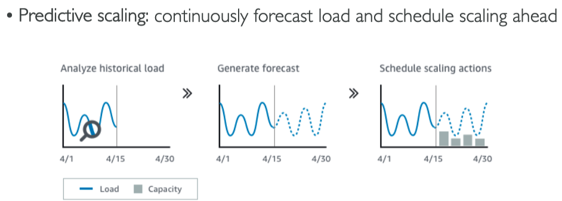
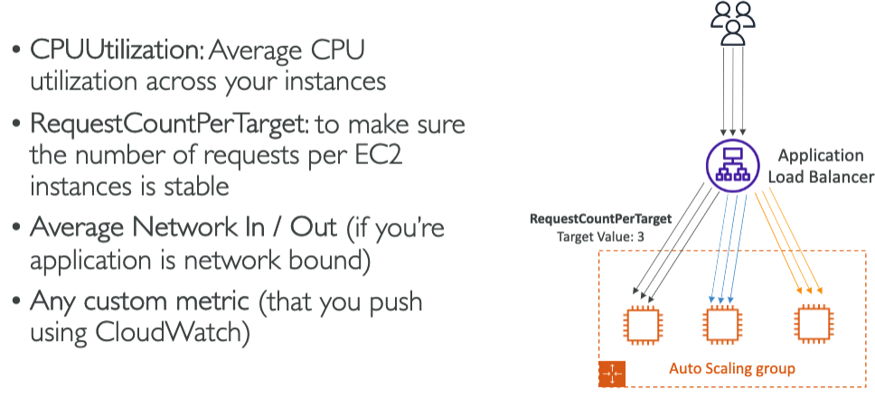
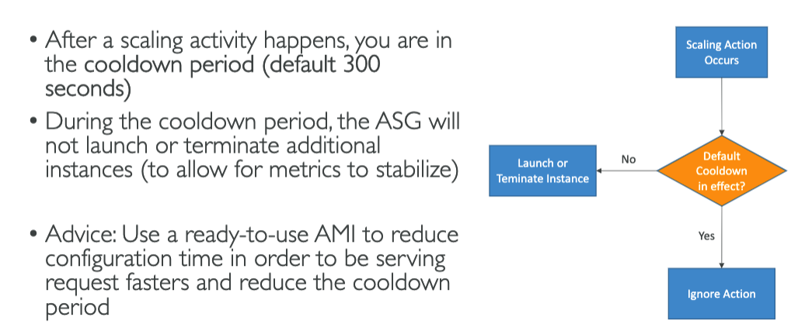

# ASG (Auto Scaling Groups)

## ASG In AWS

## ASG with ELB

## ASG Attributes

## Cloud Watch Alarms

## Dynamic Scaling Policies 

## Predictive Scaling

## Good Metrics for Scale

## Scaling Cool Downs
