# Cognito

## Amazon Cognito

- when you see 'hundreds fo users', mobile users or authenticate with SAML its cognito
  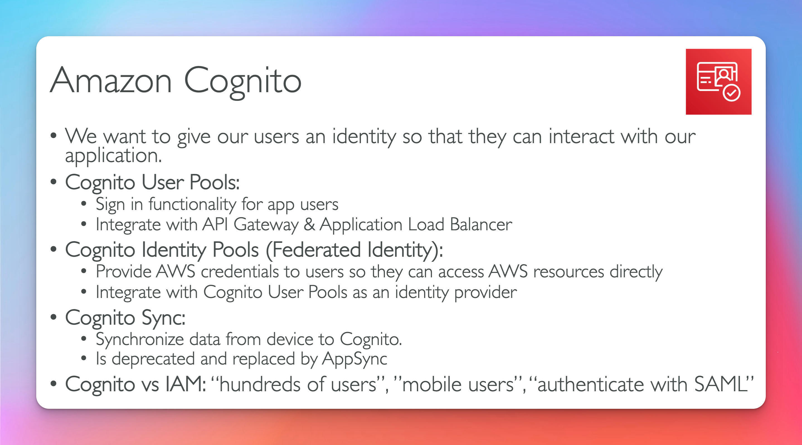

## Cognito User Pools CUP

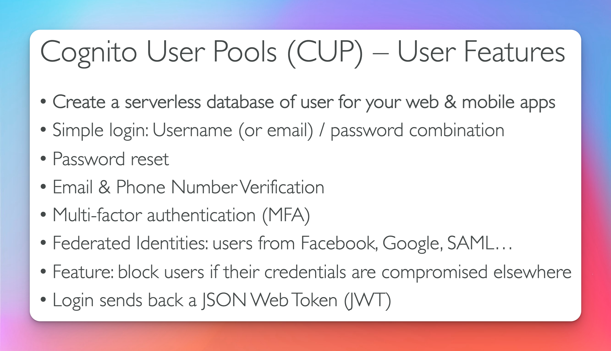

## CUP Diagram

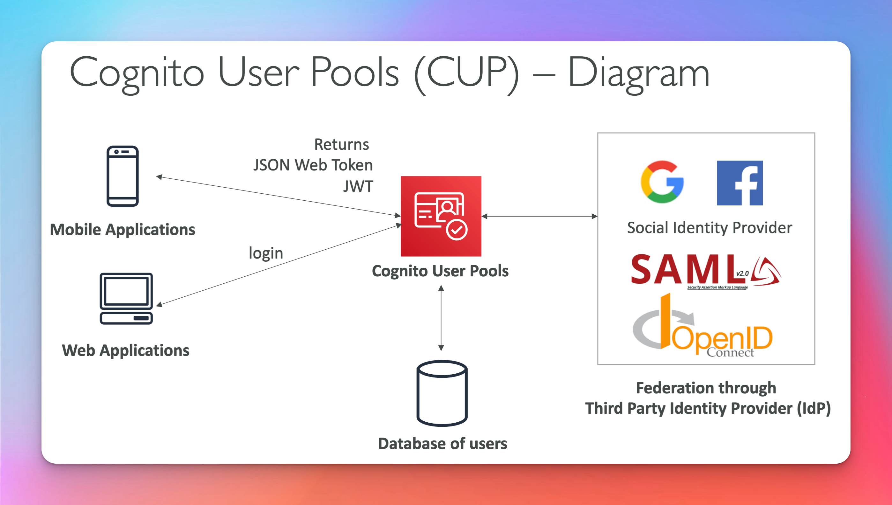

## CUP Integration

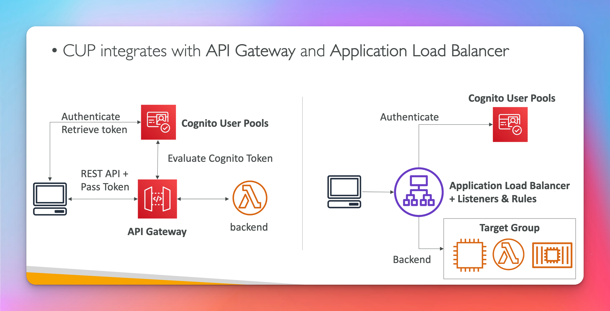

## CUP Lambda Triggers

[Official Docs Lambda Triggers ](https://docs.aws.amazon.com/cognito/latest/developerguide/cognito-user-identity-pools-working-with-aws-lambda-triggers.html)
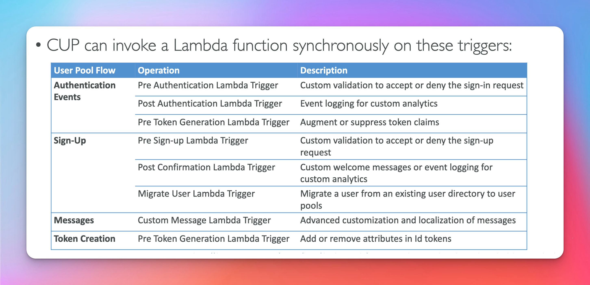

## Hosted Authentication UI

[Offical Blog Hosted Authentication UI](https://aws.amazon.com/blogs/aws/launch-amazon-cognito-user-pools-general-availability-app-integration-and-federation/)
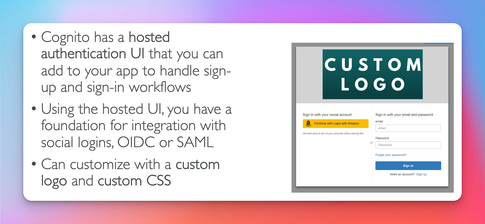

## Cognito Identity Pools (Federated Identities)

- not similar to cup (third party)
  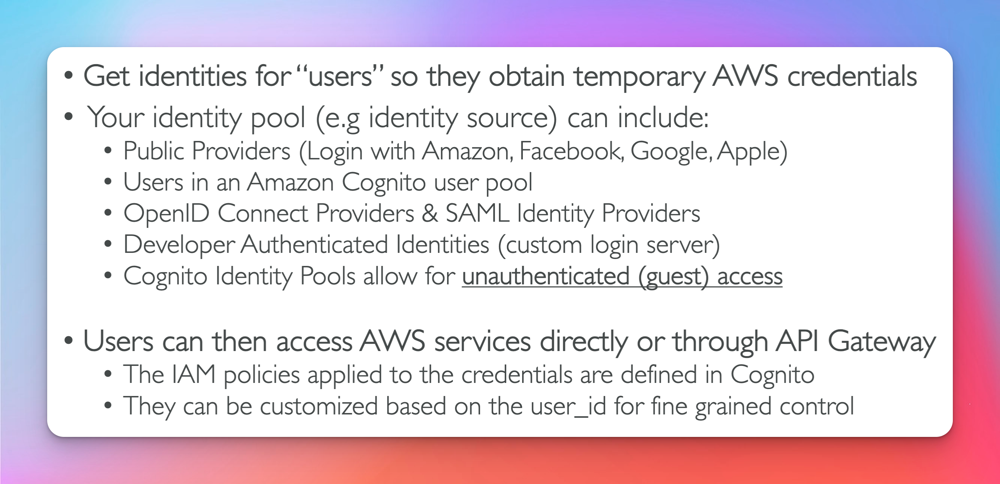

## Cognito Identity Pools Diagram

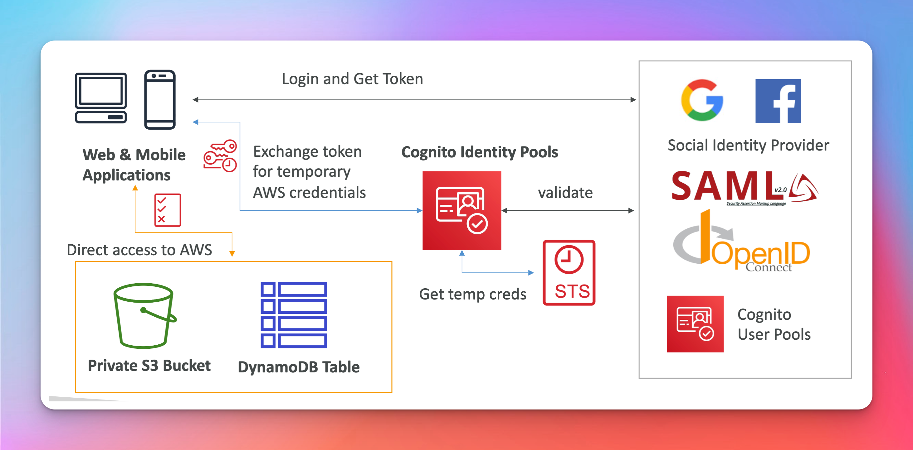

## Cognito Identity Pools with Cognito User Pools

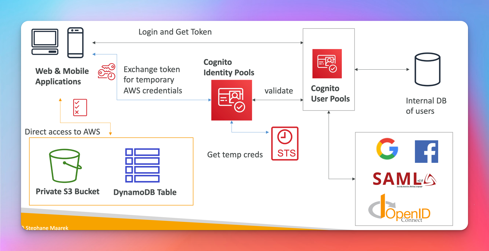

## Cognito Identity Pools Iam Roles

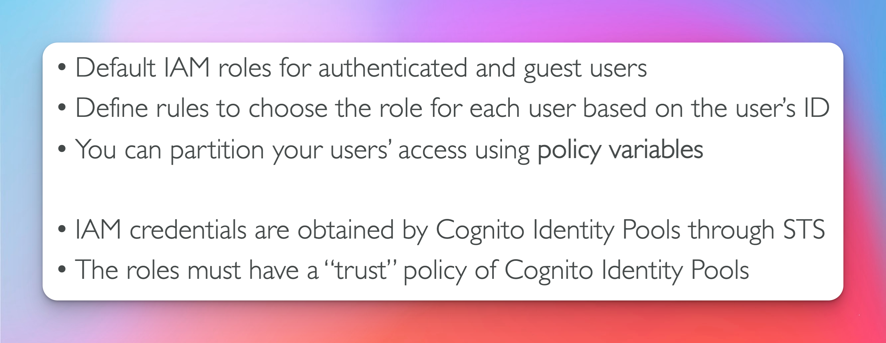

## Cognito Identity Pools Guest Users Example

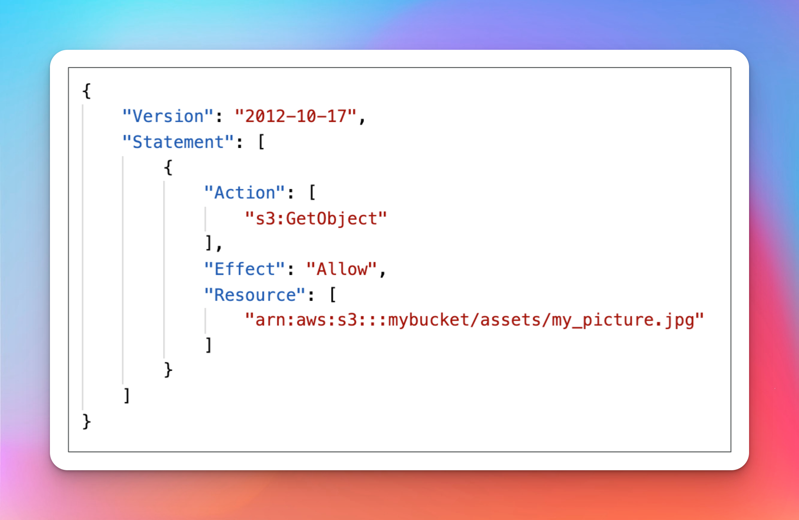

## Cognito Identity Pools Policy Vars s3

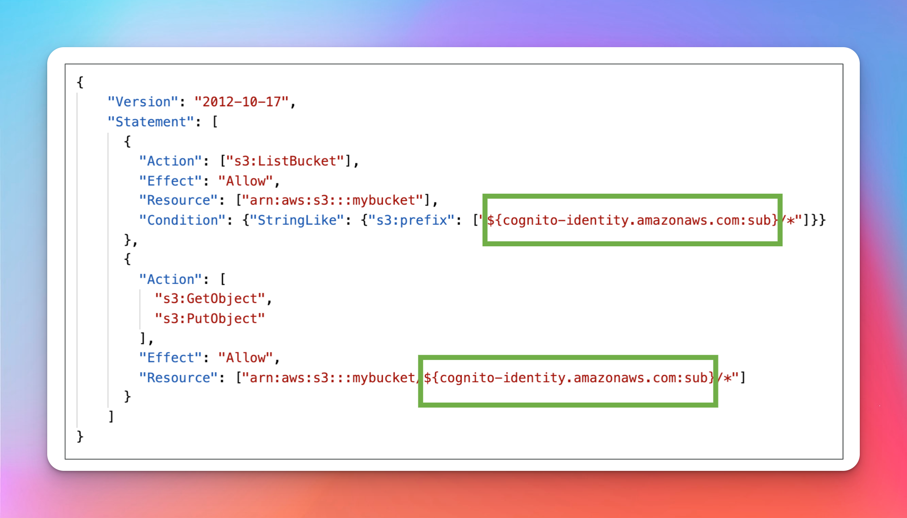

## Cognito Identity Pools Policy DynamoDB

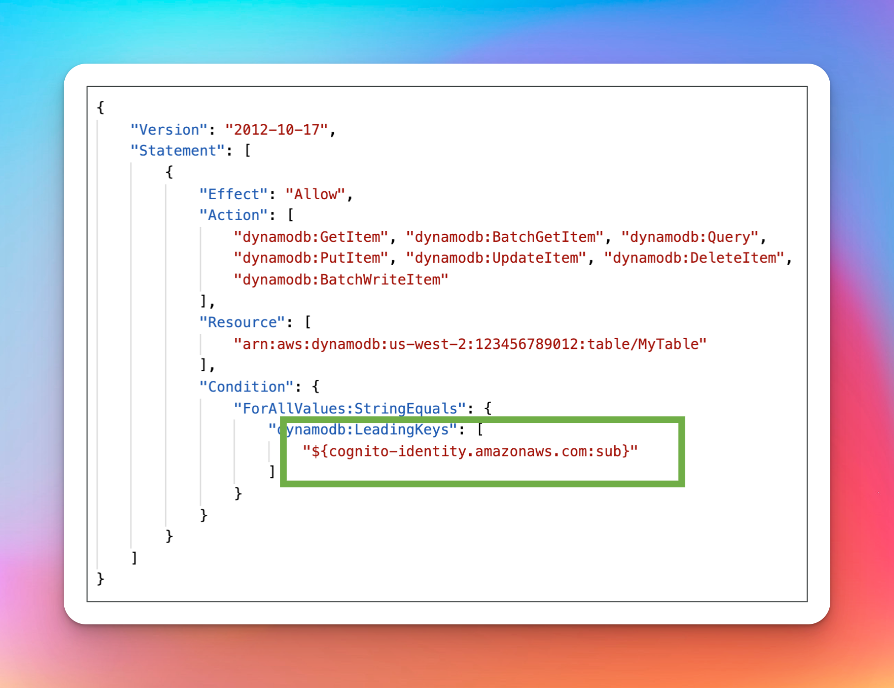

## Cognito User Pools vs Cognito Identity Pools

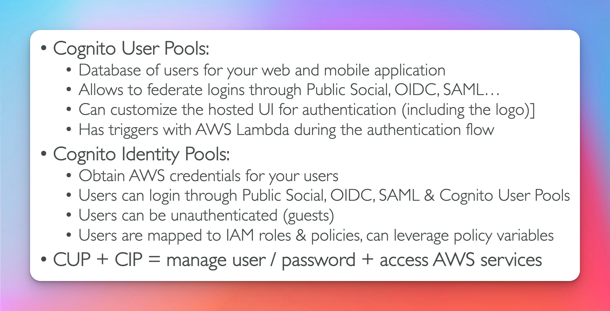

## Cognito Sync

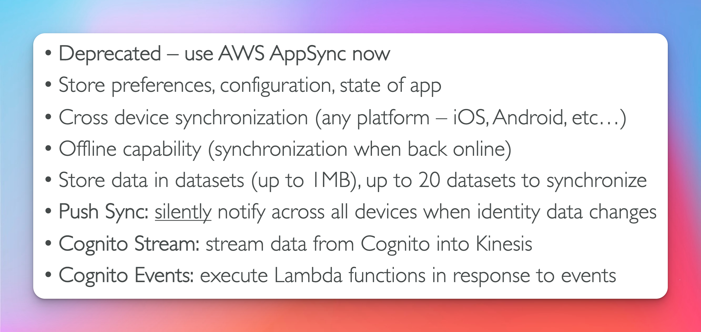

##

##

##

