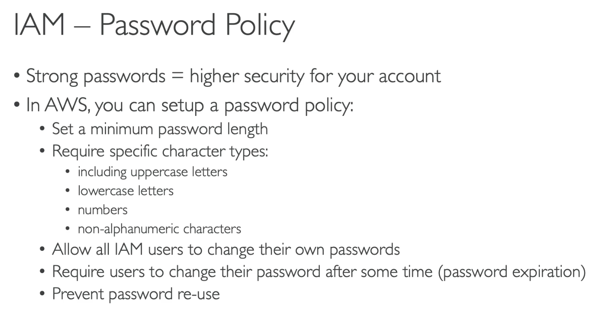
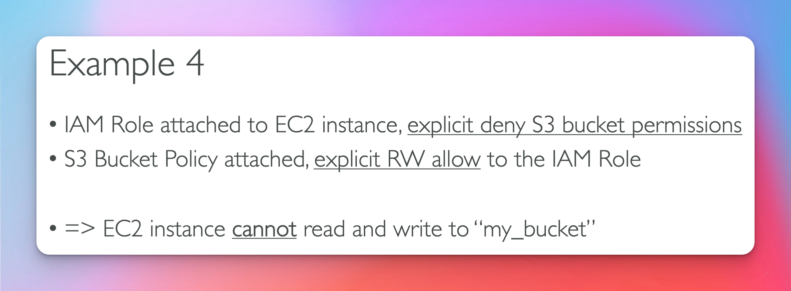

# IAM : User Groups

IAM = Identity and Access Management

This is a global service

Users, are people within your organization, and can be grouped. See screen shot below.

Groups only contain users not other groups. Users can belong to multiple groups.

# Permissions

Users or Groups can assinged JSON documents called polices.

Theses polices define permissions for the users.

**Least Privilege Principle**: _don't give more permission than a user needs._

# IAM Polices Inheritance

Note that inline policies are **only** attached to a user and can be applied to users within groups or outside of groups.

Users within multiple groups can inherit multiple policies

## Policy Structure

- Version -> policy language version, always include" 2012-10-17
- Id: identifier for the policy (optional)
- Statement: one or more individual statements (required)
  - Sid: identifier for the statement(optional)
  - Effect: whether the statement allows or denies access (Allow, Deny)
  - Principal: account/user/role to which the policy is applied.
  - Action: list of api calls (actions) this policy allows or denies.
  - Resource: list of resources to which the actions are applied to.
  - Condition: for when this policy is in effect (optional)

## Password Policy

## AWS MFA

Pros of using MFA

MFA Tools

## AWS CloudShell

A terminal within the AWS Cloud.

## IAM Roles

Assign permissions to resources (non-users) to perform actions on your behalf.

Common Roles:

- EC2 Instance Roles

- Lambda Function Roles

- CloudFormation Roles

## IAM Security Tools

1. IAM Credentials Report (Account Level)

- a report the lists all your account's users and the status of their various credentials

2. IAM Access Advisor(User-level)

- Access advisor shows the service permissions granted to a user and when those services were last accessed.
- You can use this to revise your polices

## IAM GuideLine / Best Practices

# IAM Summary

# Advanced Section

## Authorization Model (Exam Question)

## IAM & S3

## IAM & AWS Services Example 1

## IAM & AWS Services Example 2

## IAM & AWS Services Example 3

## IAM & AWS Services Example 4

## Dynamic Policies

## Dynamic Policy example

## Inline vs Managed

## Pass A Role to AWS service

## Pass A Role to AWS service Example

## Can any role be passed to any service ?

##

##

##

