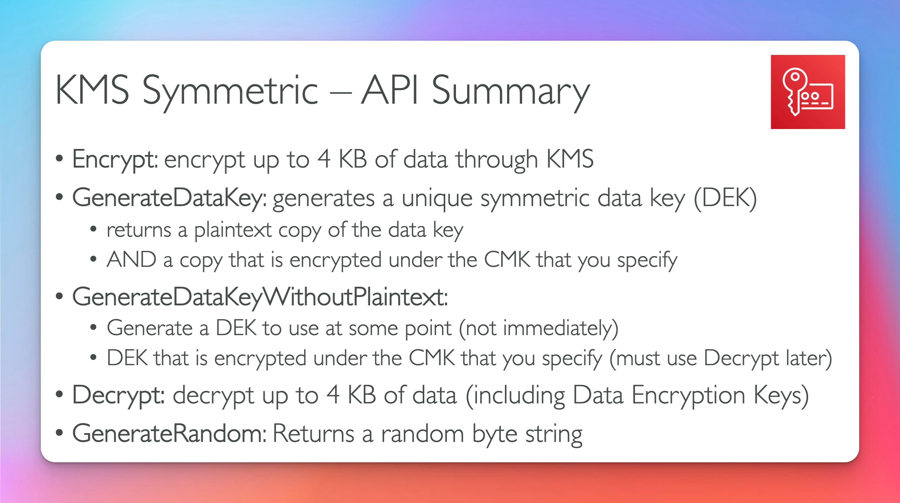

# Key Management Service KMS

## In Flight Encryption SSL

## Server Side Encryption at rest

## Client Side Encryption

## KMS (Exam Question)

- audit with CloudTrail

## Key Types

- Old name (CMK)
- New name (Key Types)
- Types
  - Symmetric
  - Asymmetric -> encryption outside aws cloud

## KMS

- Types

  - AWS Managed Keys
  - Customer Managed Key created in KMS
  - Customer Managed Key Imported

- Automatic Key Rotation
  - Aws managed kms key automatic every 1 year
  - Customer Managed kms key automatic every 1 year (must be enabled)
  - Imported Key: only manual rotation possible using alias

## Copying Snapshots Across Regions

## Key Polices

## Copying Snapshots Across Accounts

## Encrypt and Decrypt

## Envelope Encryption

- GenerateDataKey Api
- anything over 4KB needs to use Envelope Encryption
  

## GenerateDataKey (Encrypt)

## Decrypt

## Encryption SDK

## API Summary

- use GenerateDataKey not GenerateDataKeyPlainText
  

## KMS Limits

How to handle quota limits

- exponential back off
- reduce api call sent into kms by using envelope encryption
- request limit increase from AWS
  

## KMS Request Quotas

##

##

##

##

##

