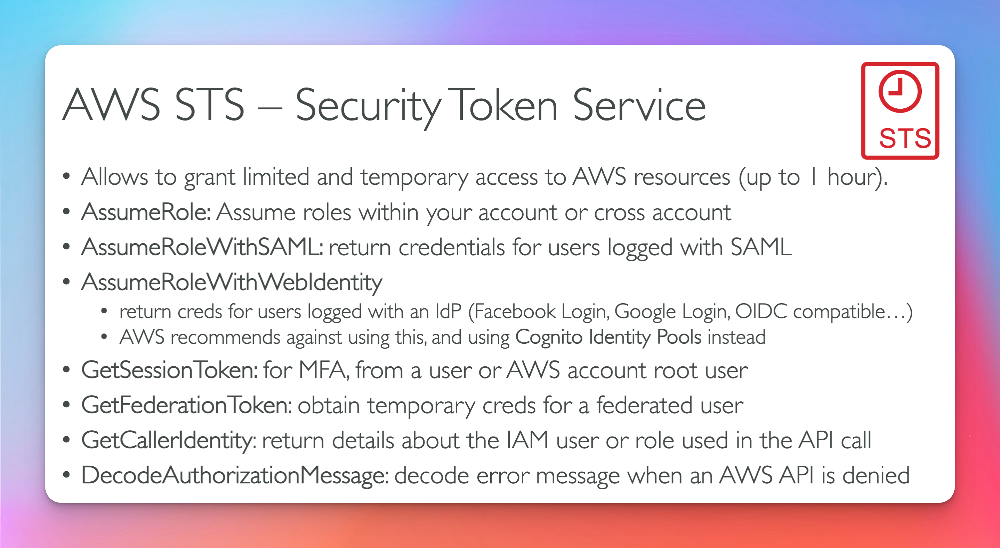
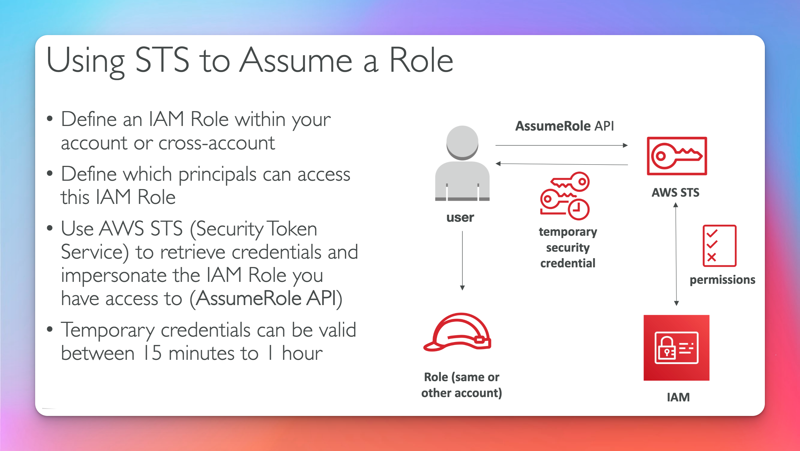
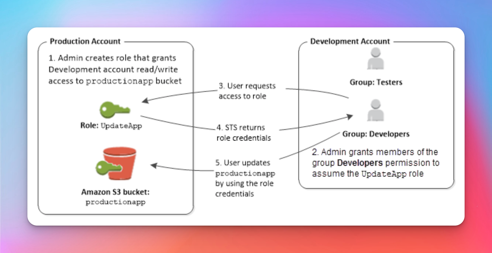
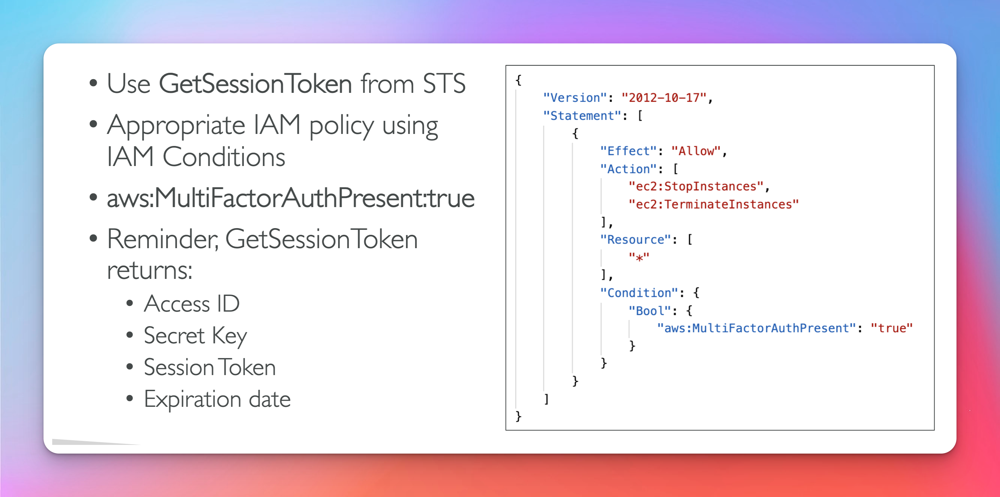

# STS Security Token Service

## Security Token Service Overview (Exam Question)

- **Important Api Calls**
- Assume Role
- GetSessionToken
- GetCallerIdentity
- DecodeAuthorizationMessage

## Assume Role

## Cross Account Access

## MFA (Exam Question)

- lab in cli section to practice
  
