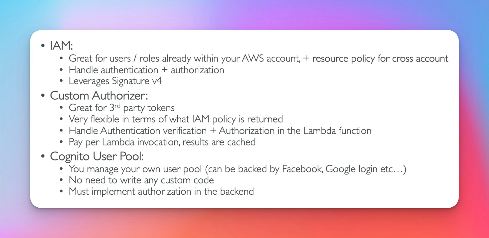

# API Gateway

## Overview

## API Gateway

## Integrations High Level

## API Gateway - AWS Service Integration

client -> api gateway -> kinesis data streams -> kinesis data firehose -> s3

- client -> sends request
- api gateway -> send data
- kinesis data stream -> sends records
- s3 -> stores json files

## Endpoint Types

## Security

- Custom Domain Name Https security through integration with ACM (Certificate Manager)
- If using Edge Optimized endpoint, there the certificate must be in us-east-1
- if using regional endpoint, the certificate must be in the api gateway region
- must setup cnmae or a-alias record in route 53
  

## Api Gateway

## Breaking Changes

## Stage Variables

## Stage Variables & Lambda Alias

## Canary Deployment

## Integration Types

## Integration Types (Lambda Proxy)

## Integration Types (HTTP Proxy)

## Mapping Templates

- VTL velocity template language
  

## SOAP API XML

## Mapping Query String

## Swagger / Open Api

## Cacheing Api Responses

## Cache Invalidations

## Usage Plans & Api Keys

## Correct Order for Api Keys

- order matters !
  

## Logging & Tracing

## CloudWatch Metric (Exam Question)

- max amount of time any api gateway can preform any request is 29 seconds
- anything over 29 seconds will trigger a timeout error

  

## Gateway Throttling

## Errors

- 4XX errors client side
- 5XX errors server side
  

## CORS (Exam Question)

## CORS Enabled (Exam Question)

## IAM Permissions

## Resource Policies

## Cognito User Pool

## Lambda Authorizer

## Security Summary

## HTTP API vs REST API

[Offical AWS Docs HTTP APIs vs REST APIs ](https://docs.aws.amazon.com/apigateway/latest/developerguide/http-api-vs-rest.html)

- HTTP low cost alternative,only supports proxy integrations, does not support usage plans and API keys
  

## Websocket Api

- stateful application use cases
- mainly used for two way communication
  

## Connecting to Websocket Api

## Connection ID

## Server to Client Messaging

## Connection Url Operations

## Websocket API Routing

- route selection expression is an exam question
- used to route to a specific backend based on routing expression (action)
- connection is already open
- routing should be apart incoming data message
  

## Architecture

