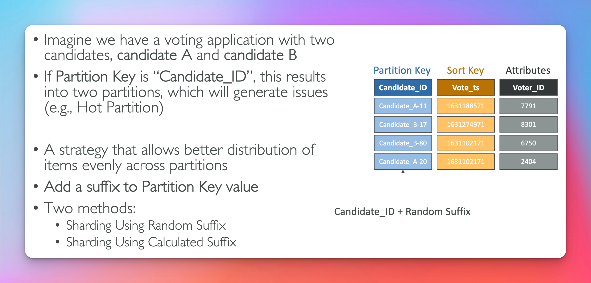

# Dynamo DB

## Traditional Architecture

## NoSql Databases

## Dynamo DB

## Dynamo DB Basics

## Dynamo DB Primary Key (Exam Question)

### Option 1

### Option 2

## Dynamo DB Partition Key Exercise

## Dynamo DB Read / Write Capacity Modes

## Provisioned

## Dynamo DB Write Capacity Units (WCU) (Exam Question)

- Always be sure to have item size is a whole number (round up)
- ( num of items per sec ) \* ( item size / 1KB )
  

## Strongly Consistent Reads vs Eventually Consistent Reads

## Dynamo DB Read Capacity Units (RCU) (Exam Question)

- For Eventually Consistent Reads - divide num of items by 2
- For Strongly Consistent Reads - divide num of items by 1
- Always be sure to have item size divisible by 4 (always round up)
- ( num of items per sec ) \* ( item size / 4KB )
  

## Dynamo DB Partition Internal

- WCU & RCU's are spread evenly across partitions
  

## Capacity Modes Throttling

## Capacity Modes On Demand

# Basic Api's

## Writing Data

## Reading Data

## Reading Data (Query)

## Reading Data (Scan)

## Delete Data (Exam Question)

## Batch Operations

## Local Secondary Index (LSI)

<pre>
You are working on designing a new DynamoDB table where you want to make a Query using an attribute that's NOT part of your table's Primary Key. You need to use the >= predicate while keeping the same Partition Key. What should you do to make this query efficient?

Answer: Local Secondary Index
</pre>

## Global Secondary Index (GSI)

## Indexes and Throttling (Exam Question)

## PartiQl

## Optimistic Locking (Exam Question)

## DAX

## DAX vs ElasticCache (Exam Question)

## Streams

## Streams Architecture

## Streams Choices (Exam Question)

## Streams & Lambda

## Time To Live (TTL)

- Used for session data
  

## Cli Good To Know (Exam Question)

- page-size it used for optimization / and avoid timeouts
  

  ## DB Transactions

  

  

  ## Transactions Capacity Computation (Exam Question)

  

  ## Session State Cache

  - ElasticCache = session state store in memory
  - Dynamo DB = auto scaling
    

## Write Sharding

## Write Types

- optimistic locking = conditonal writes
  

  ## Large Objects Pattern

  

  ## Indexing S3 Metadata (Exam Question)

  

  ## DB Operations

  

  ## Security

  - to have Global Tables you must enable streams
    

  ## User Interact Directly

  

  ## Fine Grain Access

  

  - You have Fine Grain Access control by using federated login and by specifying a condition on leadingKeys if you wanted to limit access at the role level or attributes if you wanted to limit access at the column level.
    
    
    
