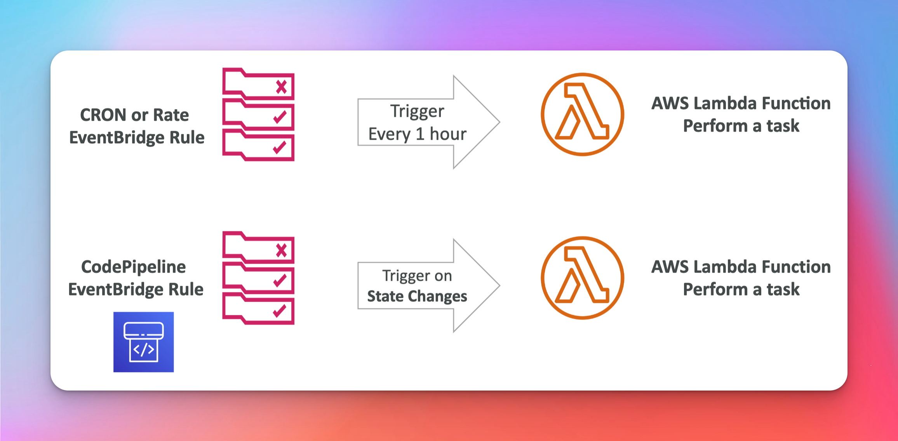
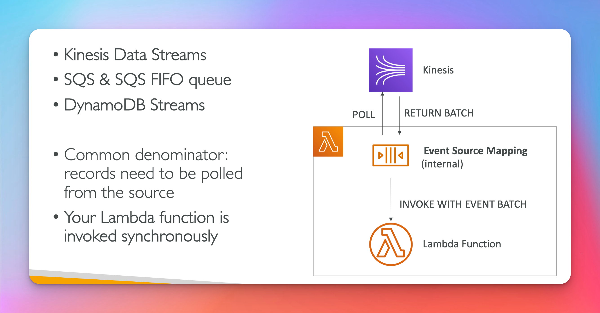
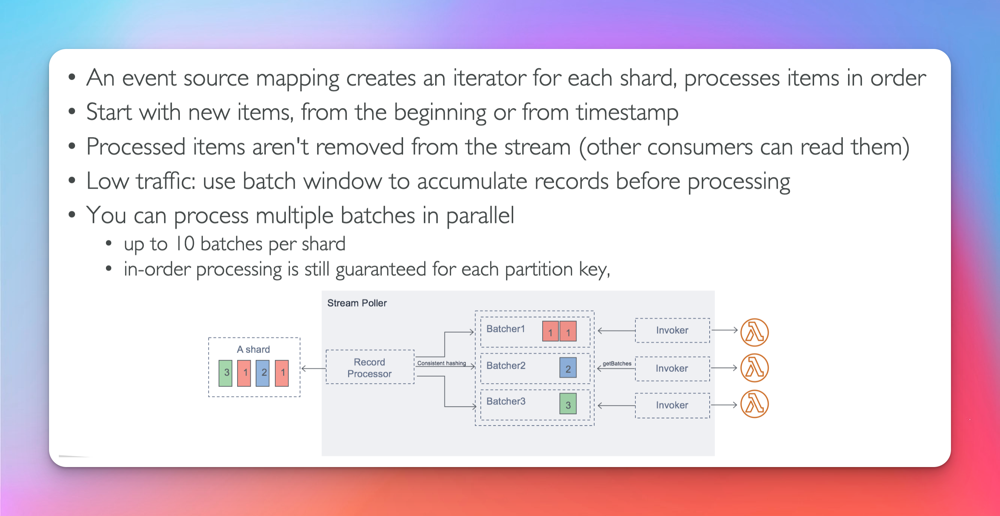
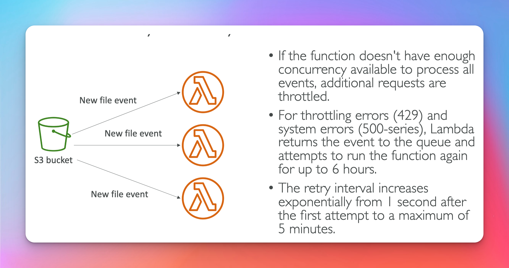
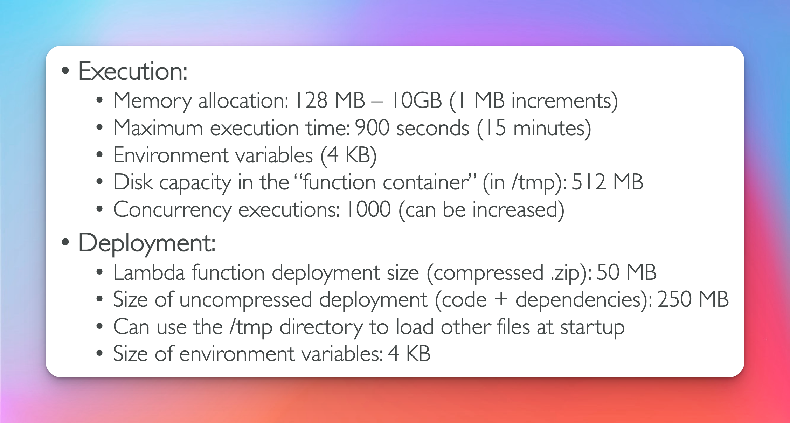

# Lambda

## What is serverless


## Serverless in AWS (Exam Question)


## Lambda


## Benefits of Lambda


## Language Support


## Main Integrations


## Example Serverless Thumbnail Creation


## Serverless Cron Job


## Lambda Pricing

[official lambda pricing](https://aws.amazon.com/lambda/pricing/)


## Synchronous Invocations

- Synchronous -> direct invocation that you wait the result of.
  

## Synchronous Invocations Services


## CLI CMD Synchronous Invocations

```
aws lambda invoke --function-name demo-lambda --cli-binary-format raw-in-base64-out --payload '{"key1": "value1", "key2": "value2", "key3": "value3" }' --region us-east-1 response.json
```

## Lambda Integration with ALB (Exam Question)


## ALB to Lambda: HTTP to JSON (Exam Question)

- Query String Parameters, Headers and Body are all converted
- Query String Parameters, Headers are KEY / VALUE PAIRS
  

## Lambda to ALB : JSON to HTTP (Exam Question)


## Multi Headers Values (Exam Question)

- This is how we support multi header values
  

## Lambda @ Edge

- Know this at a high lvl for exam


## Lambda @ Edge Continued

- Know this at a high lvl for exam


## Global Application

- Know this at a high lvl for exam


## @ Edge Use Cases

- Know this at a high lvl for exam
  

## Async Invocations

- idempotent -> incase of retries the output is the same
- you want your lambda function to have idempotent behavior
- Async Invocations can be used to increase processing speed
  

## Async Invocations Services


## EventBridge / CloudWatch



## S3 Event Notifications


## S3 Event Metadata Pattern Sync


# Event Mappers

## Event Source Mapping (Exam Question)

- Synchronous Invocation
  

## Event Source Mapping Streams (Dynamo DB || Kinesis) (Exam Question)

- Synchronous Invocation
  

## Error Handling Event Source Mapping Streams (Exam Question)


## Event Source Mapping Queue (Exam Question)

- Synchronous Invocation
  

  ## Queue & Lambda (Exam Question)

  

## Event Mapper Scaling (Exam Question)


## Lambda Destinations

[Official Async Invocation Docs ](https://docs.aws.amazon.com/lambda/latest/dg/invocation-async.html)

[Official Event Source Mapping Docs](https://docs.aws.amazon.com/lambda/latest/dg/invocation-eventsourcemapping.html)


## Lambda Execution Role

- lambda function invoked by event source mapping meaning lambda is reading the data. Or lambda function invokes other services
  

## Lambda Resource Bases Policy

- other resources / services invoking lambda function
  

  ## Lambda Env Vars

  

  ## Lambda Logging & Monitoring

  

  ## Lambda Active Tracing (Exam Question)

- AWS_XRAY_DAEMON_ADDRESS, where the ip and port of the x-ray daemon is running
  

## Lambda By Default


## Lambda Vpc

- Needs the AWSLambdaVPCAccessExecution Role Attach to Lambda
- Also needs the LambdaENIManagementAccess Role Attach


## Lambda Internet Access

- this is configured through route tables and vpc config
  

  ## Lambda Function Configuration (Exam Question)

  - anything that can be completed between 0 - 15 minutes is good for lambda
  - if not use services like fargate and ecs

  - if you need a faster cpu or more cpu cores, you accomplish this by increasing the memory option. THere is no option to increase cpu independent of memory.
  - for timeouts you want to set a time that is reasonable. b/c you want it to fail in a reasonable so that you can analyze that error case at the time it happens. This will also prevent unwanted retries.
    

## Execution Context


## Initialize Outside Handler

- so that DB connection is only established once.
  

## Functions /tmp space


## Lambda Concurrency & Throttling


## Lambda Concurrency Issues

- Concurrency applies to all the functions within your account
- So if one function goes over the limit all the others get throttled
- Throttling error code 429
- System error code 500-series
  

  ## Concurrency Async Invocations

  -retry interval will increase in exponential back off fashion
  

  ## Cold Starts Provisioned Concurrency

  [Official Provisioned Concurrency Improvements ](https://aws.amazon.com/blogs/compute/announcing-improved-vpc-networking-for-aws-lambda-functions/)

  

  ## Reserved Concurrency vs Provisioned Concurrency

  [Official Reserved Concurrency ](https://docs.aws.amazon.com/lambda/latest/dg/configuration-concurrency.html)

  **Concurrency Error Message**

  - Calling the invoke API action failed with this message: Rate Exceeded

  

  ## Lambda Function Dependencies

  

  ## Lambda & CloudFormation

  

  ## Lambda & CloudFormation through s3

  

  ## Lambda & CloudFormation through s3 milt Account

  - bucket policy -> allow resource from different accounts access to bucket
  - execution role -> allow get and list commands
    

    ## Lambda Layers

    - use when you need to reuse libraries
    - used to deploy functions faster / no need to repackage dependencies when using layers
    - Also multiple function can reference the same layers

      [Rust Lambda Run Time](https://github.com/awslabs/aws-lambda-rust-runtime)

      [C++ Lambda Run Time](https://github.com/awslabs/aws-lambda-cpp)
      

## Container Images


## Container Images Continued


## Lambda Version

- $LATEST is mutable
- Version is Immutable
  

# Lambda Aliases (Exam Question)

- Aliases is mutable
- Enable Blue Green Deployments
- Aliases **cannot** reference other aliases
  

  ## Lambda CodeDeploy

  

  ## Lambda Limits (Exam Question)

  - limits are **per region**
  - if use cases exceed these limits then lambda is not the right solution
    

## Best Practices

- avoid recursive code -> lambda should never call itself
  
