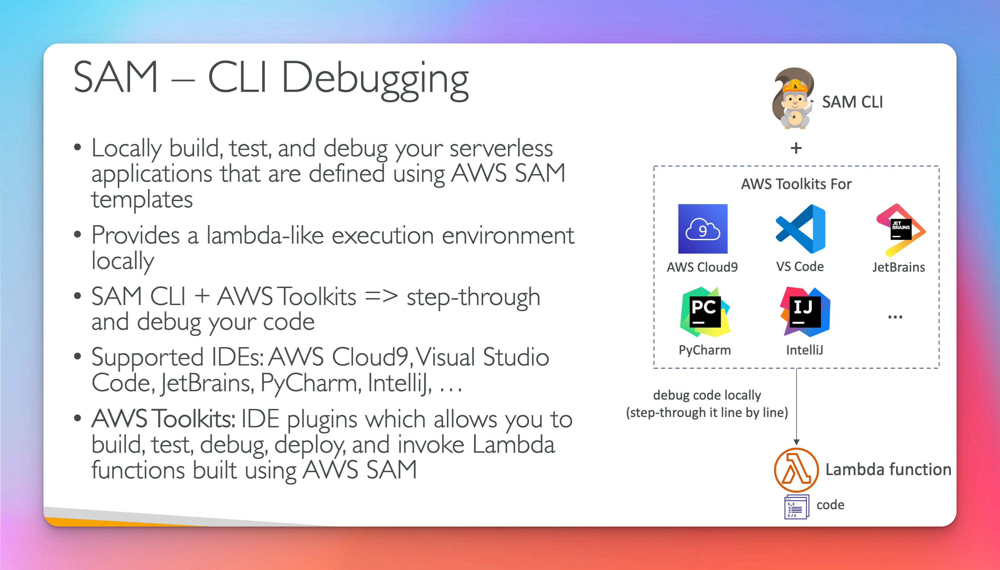

# Sam Serverless Application Model

## Sam Serverless Application Model Overview

## Sam Serverless Application Model Recipe

- Cli Cmds for Exam
- aws cloudformation package / **sam package**
- aws cloudformation deploy / **sam deploy**
  

  ## Sam Serverless Application Model Deployment

  - Cli Cmds in Order
  - **sam build** -> transformed into cloudformation template
  - **sam package** -> packages application
  - **sam deploy** -> deploys application
    

  ## Sam CLI

  - run lambda locally
    

## Sam Policy Templates

- [official templates](https://docs.aws.amazon.com/serverless-application-model/latest/developerguide/serverless-policy-templates.html)
  

## Sam and CodeDeploy

## Sam Exam Summary

## SAR Serverless Application Repository

