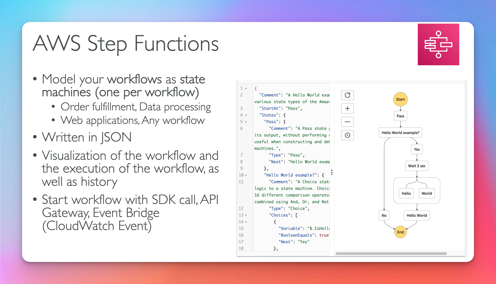
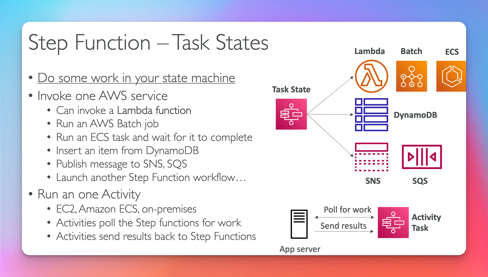
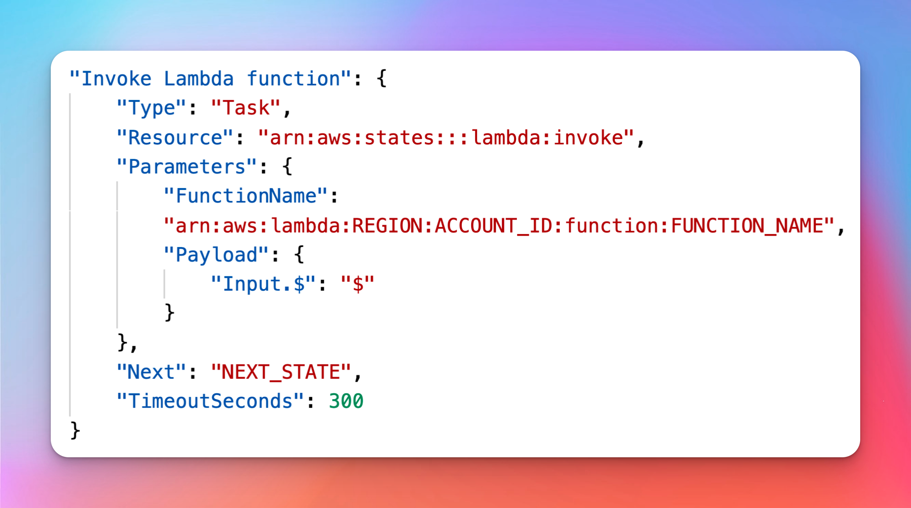
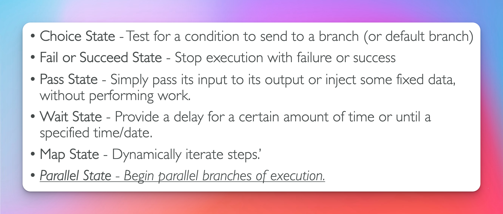
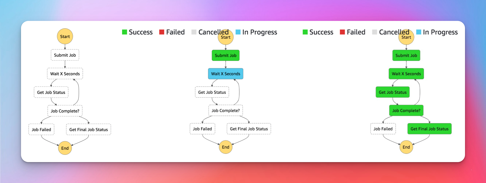
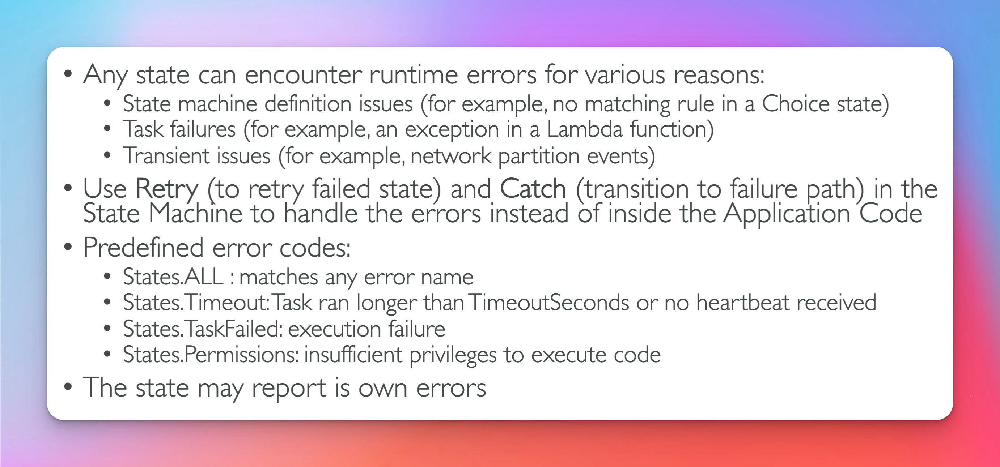
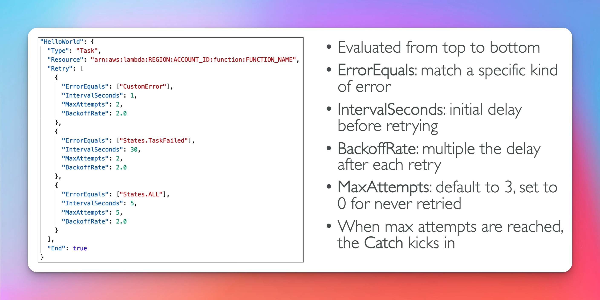
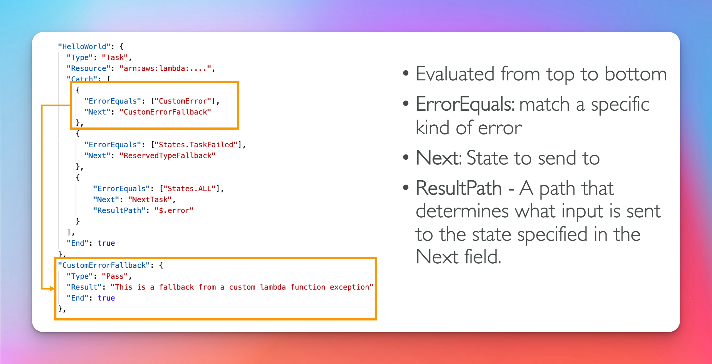
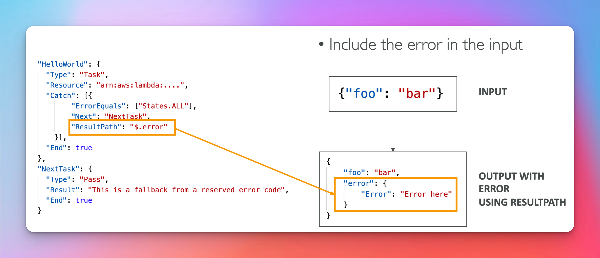
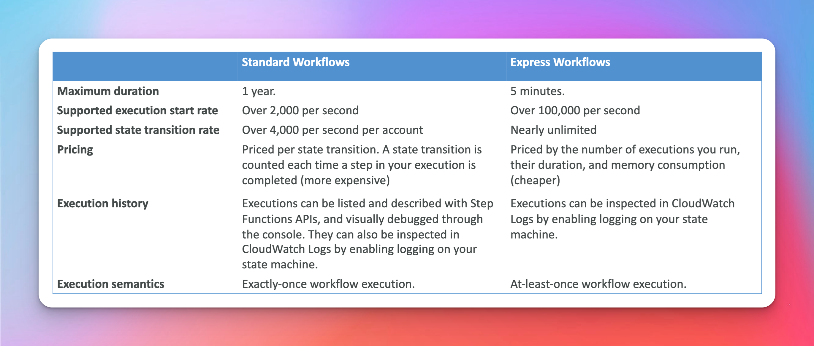

# Step Functions

## Overview

## Task States (Exam Question)

## Invoke Lambda Function

## States (Exam Question)

- Parallel States

## Visual Workflow

## Error Handling

## Retry (Task Or Parallel)

- keep retry logic outside the lambda function
  

## Catch (Task Or Parallel)

## Result Path (Exam Question)

## Standard vs Express (Exam Question)

