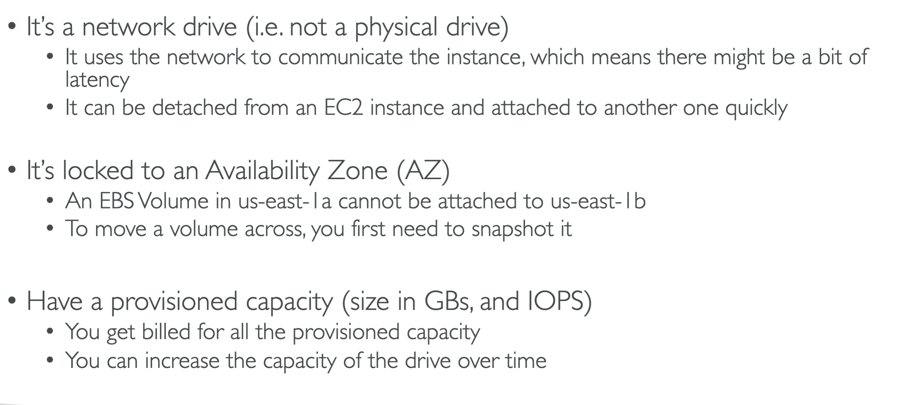
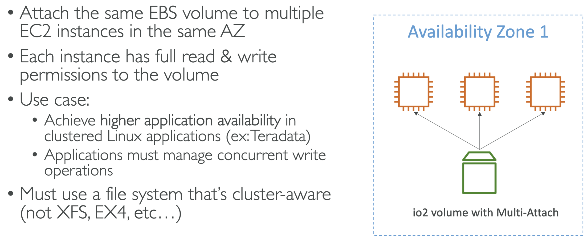

# EBS  (Elastic Block Storage)

### EBS 101

## Example

## Delete on Termination (exam question)

## EBS Snapshots

## Snapshot Features

## Instance Store

## Instance Store Comparison (exam question)
  - when you see high performance volume attached hardware for EC2 think instance store

## Volume Types 

> IOPS = operations per second

# Use Cases

### SSD (exam question)

> Used For **Cost Effective Storage**

>gp3 IOPS and throughput **not** linked

>gp2  IOPS and throughput **are** linked
### PIOPS SSD (exam question)

> io1 || io2 Used For **Critical Business Applications**

> io1 || io2 Or for applications that use **more than 16,000 IOPS**
 
>io1 || io2 IOPS and throughput **not** linked

>to attain **over 32,000 IOPS** you need an **Nitro EC2** with **io1** || **io2**
### HDD

## Summary

## EBS Multi-Attach io1 || io2 (exam question)
 

 > you **can** attach the same ebs volume to **multiple** EC2 instances **only** if criteria above is met.

 - cluster aware
 - need to be part of io1 || io2 family

 # EBS VS EFS
 
 

 

 > EBS is for a network volume that can needs to be mounted on one instance.

 > You pay for what you provision not what you use.

 > Instance store is used to get the maxium IOPS out of an instance. You will lose data if instance is terminated because instance store is an ephemeral drive.