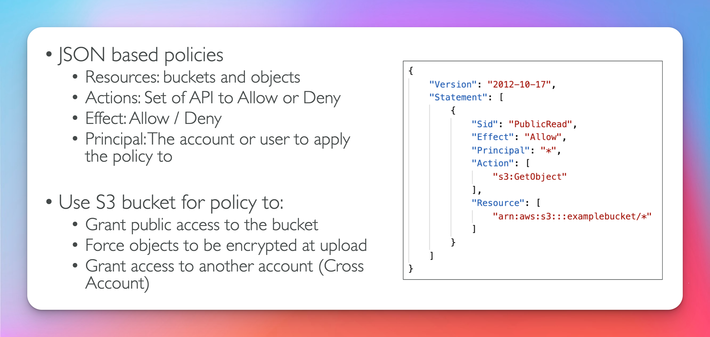
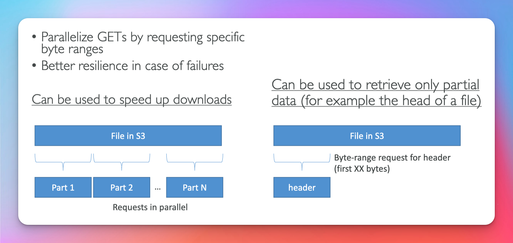
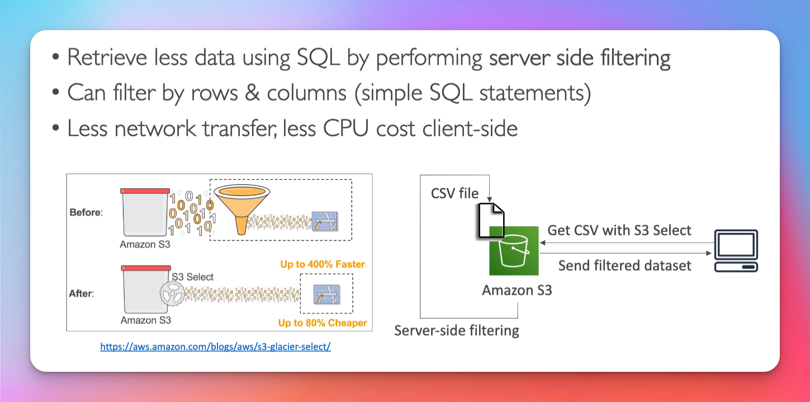

# Amazon S3 Simple Storage Service

### Common Use Cases

- Backup and Storage
- Disaster Recovery
- Archive
- Hybrid Cloud Storage
- Application Hosting
- Media Hosting
- Data lakes & Big Data analytics
- Software Delivery
- Static Website

## Overview

## Security

## Policies

## Policies vs Roles

**IAM policies are for users**

**IAM roles are for resources**

**cross account access uses s3 bucket policy**

## Block Public Access

## Static Hosting

## Versioning

## SRR vs CRR

## Replication Notes

- After you enable Replication only new Objects are replicated
- Optionally, you can replicate existing objects using S3 Batch Replication
- Replicates existing object and object that failed replication

- For DELETE operations

  - Can replicate delete markers from source to target (optional setting)
  - Deletions with a version ID are not replicated (to avoid malicious deletes)

- There is no 'chaining' of replication

  - if bucket 1 has replication into bucket 2 which has replication into bucket 3
  - **objects created in bucket 1 are not replicated to bucket 3**
  - replication only works if versioning is enabled
  - delete markers can be replicated (its disabled by default)
  - permanent deletes in origin bucket are **not** replicated

  ## S3 Storage Classes

  

  - ### S3 Standard - General Purpose

    - 99.99% available
    - used for frequently accessed data
    - low latency and high through put
    - sustain 2 concurrent facility failures
      **Use Cases**
    - Big Data Analytics
    - Mobile & gaming
    - Content Distribution

  - ### S3 Standard Infrequent Access (IA)

    - For data that is less frequently accessed, but requires rapid access when needed
    - lower cost the S3 standard
    - 99.99% available
      **Use Cases**
    - Disaster Recovery
    - Backups

  - ### S3 One Zone-Infrequent Access
    - High Durability (99.999999999%)
    - 99.95% available
      **Use Cases**
    - Storing Secondary backups (data you can recreate)
  - ### S3 Glacier Instant Retrieval
    - Low cost object storage meant for archiving / backup
    - Millisecond retrieval, great for data accessed once a quater
    - minium storage is 90 days
  - ### S3 Glacier Flexible Retrieval
    - Expedited (1 to 5 miniutes), Standard (3 to 5 hrs), Bulk(5 to 12 hrs) free
    - minium storage is 90 days
  - ### S3 Glacier Deep Archive

    - Standard (12 hours), Bulk(48 hours)
    - minium storage is 180 days

  - ### S3 Intelligent Tiering

    - small monthly monitoring and auto-tiering fee
    - Moves objects automatically between Access Tier based on usage
    - no retrieval charges in S3 Intelligent Tiering

    - Frequent Access Tier(automatic): default teir
    - Infrequent Access Tier (automatic): object not accessed for 30 days
    - Archive Instant Access Tier (optional): object not accessed for 90 days
    - Archive Access Tier (optional): configurable from 90 days to 700+ days
    - Deep Archive Access Tier (optional): config from 180 days from 700+ days

  You can move between classes manually or using S3 Lifecyle Configurations

  ## S3 Durability and Availability

  1. ### Durability

  - High Durability (99.999999999%) of objs across multiple AZ
  - If you store 10,000,0000 objects you will lose one object every 10,000 years
  - Same for all storage classes

  2. ### Availability

  - How readily avaiable a service is
  - Varies depending on storage class
  - example: s3 standard has 99.99% availablity = not available for 53 min per year

# Advanced S3 Section

## Moving Between Classes

## Life Cycle Rules

## Life Cycle Scenario 1

## Life Cycle Scenario 2

## S3 Analytics - Storage Class Analysis

- 24 - 48 hours to start seeing data analysis
- CSV report updated daily
- Good first step to put together lifecycle rules
- does not work for One-Zone IA or Glacier

## Event Notifications

## Event Bridge

## S3 Performance ( Exam Question )

**Multi Part && Transfer Acceleration** ( Exam Question )

**Byte Range Fetch** ( Exam Question )

**KMS Limitations** ( Exam Question )

## S3 Select & Glacier Select

# Advanced S3 Section (Security)

## Object Encryption (exam question)

## SSE S3

## SSE KMS (Key Management Service)

- audit key usage using CloudTrail

## KMS Limitations ( Exam Question )

## SSE-C

## Client Side Encryption

## In transit (SSL/TLS)

## Default Encryption vs Bucket Policy

## CORS (Cross Origin Resource Sharing)

## S3 Cors

## S3 Access Logs

- Logs all access to s3
- any request made to s3 from any account, authorized or denied
- must be in same region
- user -> monitoring-bucket -> logging bucket
- make sure you logging bucket and monitoring bucket are DIFFERENT. If they are the same it will create a logging log. THAT YOU WILL PAY FOR.

## Pre Signed Url

- Generate using s3 console, cli or SDK
- Url Expiration S3 Console - 1 - 720 mins (12 hours)
- ClI 3600 secs - 694800 secs (168 hours)
- Users given a pre-signed URL inherit permissions of the user that generated the URL for Get/Put

Common Use Case: For temporary access to read / download a secure file

Example: Alow only logged-in users to download a premium video from your S3 bucket

Example: Allow an ever changing list of users to download files by generating urls dynamically

Example: Allow a user to upload a file to a precise location in your s3 bucket.

## S3 Access Points

- Each Access Point Gets it own DNS and Policy to limit who can access it
  - A specific IAM User / Group
  - One policy per access point -> Easier to mange than complex bucket polices

## S3 Object Lambda

- Use Lambda Functions to change object before it is retrieved by caller application
- Only one s3 bucket is needed on to of which we create a3 Access Point and s3 Object Lambda Access Points
  

# Advanced

## SSE KMS

## Deep Dive

## Force SSL

## Force Encryption SSE-KMS

[Official Docs](https://aws.amazon.com/premiumsupport/knowledge-center/s3-bucket-policy-for-config-rule/)

## Bucket Key

