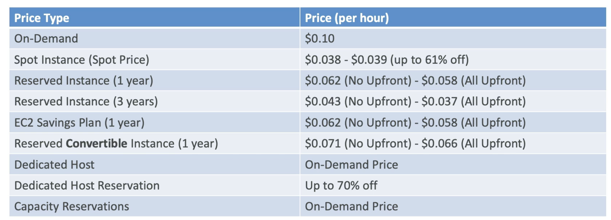

# Elastic Compute Cloud

EC2 = Infrastructure as a Service

- Rent VM's (EC2)
- Store data on Virtual Drives (EBS)
- Distributing load across machines (ELB)
- Scaling the services using an auto-scaling group (ASG)

## Sizings & Config Options

- OS -> Linux, Windows, or Mac OS
- Computer Power && Cores (CPU) -> 1 , 4, 16, 32, 64
- RAM (GiB) -> 1, 16, 32. 128, 512
- Storage Space -> EBS or NVM SSD
- Network Card -> low, moderate, 1 - 10Gbps , 20Gbps
  - Network Attached (EBS && EFS)
  - Hardware (EC2 Instance Store)
- Firewall rules -> security groups

## Instance Type Breakdown

### Catagories
- General Purpose -> T2.
  
- Compute Optimized -> C6g.
  
- Memory Optimized -> R6g
 
- Accelerated Computing
- Storage Optimized -> I3

- Instance Features
- Measuring Instance Performance

[Official AWS Instance Types](https://aws.amazon.com/ec2/instance-types/?trk=36c6da98-7b20-48fa-8225-4784bced9843&sc_channel=ps&sc_campaign=acquisition&sc_medium=ACQ-P|PS-GO|Brand|Desktop|SU|Compute|EC2|US|EN|Text&s_kwcid=AL!4422!3!536392622533!e!!g!!aws%20ec2%20instance&ef_id=CjwKCAjwmJeYBhAwEiwAXlg0AUpuUWewkOv4xE5_GeDYClQEfs2TCHQLd65uKDiQ5kcc2W2mL6SW4RoCyu0QAvD_BwE:G:s&s_kwcid=AL!4422!3!536392622533!e!!g!!aws%20ec2%20instance "AWS")

[EC2 Comparison Info](https://instances.vantage.sh/)

### Naming BreakDown

## EC2 User Data
Bootstrap script (configure / launch): EC2 User Data

## Security Groups

 
 These groups act as a **firewall** on the instance.

 They can **control** the following
 - Access to ports
 - Authorize IPv4 and Ipv6 ranges
 - Block / Allow inbound traffic
 - Block / Allow outbound traffic

**Security Groups are listed as follows.**
<pre>
| Type | Protocol | Port Range |  Source   | Description |
| ---- | -------- | ---------- | --------- |  ---------- |
| HTTP |    TCP   |     80     | 0.0.0.0/0 |  node app   |
</pre>
## Security Groups Pro Tip

## Security Groups Refereeing Each Other
This is common practice.

## Ports 
- 22 = SSH ( secure shell ) - log into a linux instance
- 21 = FTP (file transfer protocol) - uploads files into a file share
- 22 = SFTP (secure file transfer protocol ) - upload files via SSH
- 80 = HTTP - access **unsecured** websites
- 443 = HTTPS access **secured** websites
- 3389 = RDP (Remote Desktop Protocol) - log into a windows instance

## Purchasing Options

### EC2 On Demand

### EC2 Reserved 
 

### EC2 Savings 
 

 ### EC2 Spot Instance 
 > exam will test you on whether they are suited for databases and critical jobs ( they are not )

 

 ### EC2 Dedicated Host 
 

 ### EC2 Dedicated Instances

 <h2> Dedicated Host vs  Dedicated Instances</h2>

## Capacity Reservations
 

## What is best for my situation ?
 

 ## Pricing Breakdown m4.large us-east-1
  

## AWS EC2 Pro Tips
>When you stop and ec2 instance and start it again aws will changes the PUBLIC IP of that instance, However the PRIVATE IP will NOT change. 

>When you encounter a timeout issue this is usually (99.999%) a security group issue.

>Never enter your AWS Access Key or AWS Secret Access Key on an EC2 instance. ( it is no bueno)

# Side Note:

> GiB (Gibibytes) is a standard unit used in the field of data processing and transmission and is defined as base 1024 rather than base 1000. For example, 1 GB is defined as 1000³ bytes, whereas 1 GiB is defined as 1024³ bytes.

## Example of Conversions:

<pre>
1 GB = 0.93 GiB

1 TB = 0.91 TiB = 931 GiB

1 TiB = 1.1 TB = 1100 GB
</pre>
## How is this converted
<pre>
GB to GiB

Multiply by (1000³ / 1024³), equivalent to 0.931323

Divide by this value to go from GiB to GB

TB to TiB

Multiply by (1000⁴ / 1024⁴), equivalent to 0.909495

Divide by this value to go from TiB to TB

GiB to TiB

Divide by 1024

Multiply by 1024 to go from TiB to GiB

GiB to TB

Convert into GB by dividing by 0.931323, then divide by 1000 to get into TB
</pre>
## Why is this important ?
>Example customer has two disks in each server, with each disk capacity being 2.2 TB SSD. Therefore, the total drive size equals 4.4 TB or 4.001777 TiB which across 100 hosts would mean the capacity totals 440 TB or 400.1777 TiB.

>The monthly charge would therefore be 400.1777 TiB, which when multiplied by 1024 to convert into GiB is 409,781.9 GiB. At a rate of 10p/GiB, the monthly charge would be $40,978.19 per month, equating to £409.78 per server.

>To illustrate the difference between GiB and GB, if we charged at a rate of 10p/GB (instead of GiB) then you would be charged for 440,000 GB which equates to a total cost of $44,000 or $440 per server. This provides a significant price difference of $3,121.81 per month, a 7.6% increase in cost. **By pricing our services at £/GiB you will be charged for around 93% of the total cost had prices been listed per GB.**