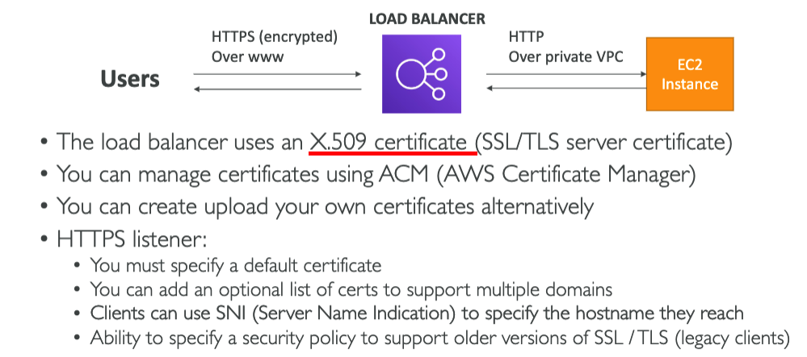

# ELB (Elastic Load Balancer)

### What is Load Balancing

### Use Cases for Load Balancing

## ELB
1. **Aws Managed** 
2. **Integrated with AWS services / offerings**

## Health Checks

## Types of ELB's
    

1. ## CLB - classic load balancer (might be exam question)
    
2. ## ALB - application load balancer
      1. 

      2. 
        HTTP Based Traffic
      3. 
      4. 
      5. 
      6. 

3. NLB - network load balancer
    1. 
    2. 
    3. 
4. GWLB - gateway load balancer
    1. 
    2. 

# Advannced Load Balancing Concepts
## Security Groups && Load Balancers 

## Sticky Sessions (Session Affinity)

## Cookie Names (need to know for Cloud Front )

## Cross Zone Load Balancing

## Cross Zone Load Balancing by Type

## SSL & TLS Basics
 - SSL (old)
 - TLS (new)

## SSL Certs

## Server Name Indication (SNI) (important!)

## SSL by LB Type

## Connection Draining 
